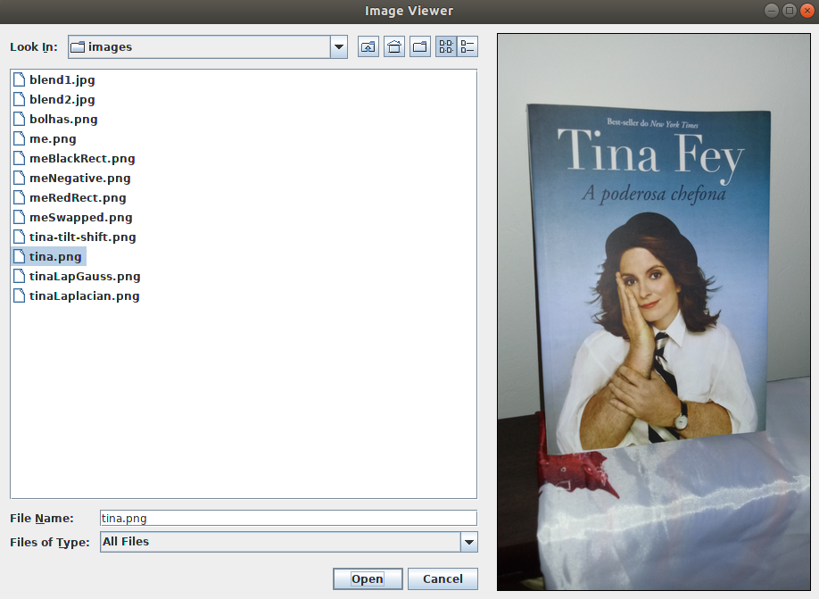
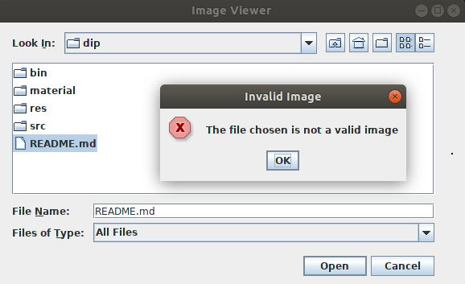
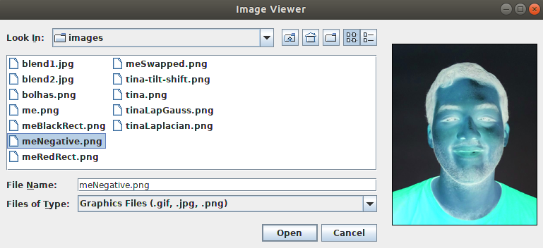

Hello, Tina Fey's Bossypants
############################

:date: 10-17-2018 22:00
:modified: 10-17-2018 22:00
:tags: java; swing; opencv; dip
:category: digital image processing
:slug: tina-fey-opencv
:authors: André Fellipe
:summary: An application that loads an image using the OpenCV library. This post was written to the sound of `San Cisco's`_ eponymous album. You can listen one of the songs here_.

Here's a not so hot take: Tina Fey is awesome. Her accomplishments as a performer, writer and producer on Saturday Night Live, 30 Rock, Mean Girls, Unbreakable Kimmy Schmidt and other projects make her one of the greatest comedy minds of the 21st century.

And what's the relation between Tina Fey, the OpenCV library and Java?

None. I just find her incredible and I'm loving her autobiography, 2011's Bossypants.

Anyway, today we'll build an application where the user can choose a file from its file system and, if it's a valid image, it gets displayed on the screen. Let's call it **Image Viewer**.

You can see the final result below:

Creating the user interface
===========================

Inside the OpenCV library, we have a cross-platform GUI called HighGUI_ and a method called `imshow()`_. With this method, we can create a window and display an image within it. This is an easy and quick way to create prototypes.

Unfortunately, there wasn't an **imshow()** method available for Java for a good amount of time, so we see a lot of work and tutorials using the Swing package, a popular GUI API that we've used on other posts before.

Thanks to this situation, we will use Swing to build the interfaces that we need. If your knowledge of Swing is limited, I recommend that you take a look at some `previous posts made here`_.

Oh yeah, there's another thing, I'm using **OpenCV 3.2.0** and I don't think there's a Java wrapper to the **OpenCV HighGUI** module. Newer versions of the library have it, though.

The first thing we need to do, assuming that you've already know a little about Swing and can create a basic frame, is load the OpenCV library. We do this with the `loadLibrary()`_ method from the System_ class. Also, in the image above, we can see that our application needs a JFileChooser_ and a JLabel_. This means that, before the main method and the frame constructor, we need bring all of these components to life. We do this with the following code:

.. code-include:: ../../dip/src/Exercise01.java
    :lexer: java
    :encoding: utf-8
    :tab-width: 2
    :start-line: 38
    :end-line: 51

With this ready, we style the components to provide a better user experience, add them to the content pane and add the necessary listeners. For instance, we use the `addChoosableFileFilter()`_ method from the **JFileChooser** to allow the user to filter the search results in the directories. In our case, we only want to display images, so we will filter the **.gif**, **.jpg** and **.png** files. To do this, we need an object from the FileNameExtensionFilter_ class.

The following code implements these tasks in our components:

.. code-include:: ../../dip/src/Exercise01.java
    :lexer: java
    :encoding: utf-8
    :tab-width: 2
    :start-line: 84
    :end-line: 112

Now our interface is ready. When we see the **imageChooser** component on our screen, we see that there are two buttons. One with the name "Open" and another one with the name "Cancel". The `actionPerformed()`_ method is called when the user clicks on one of these buttons. Now, we need to define the behaviour of the application when one of these events is triggered. Our helper method **imageChooserActionPerformed()** will handle this.

Showing the image on the screen
===============================

With the `getActionCommand()`_ method from the ActionEvent_ class we can determine which button was clicked. We know that the property `APPROVE_SELECTION`_ from the **JFileChooser** class is related to the "Open" button, so we assume that any other action will be related to the "Cancel" button since we're only interested in opening the image when the user clicks in the "Open" button.

When the user clicks the "Open" button it means that he wants to see the image that the file represents in the screen. We need to find a way to pass this information to the OpenCV library so that it may help us open the file. Let's create a **String** named **filePath** that will store the path to the selected file. This string will store the result of the call of two methods: `getSelectedFile()`_ from the **JFileChooser** class and `toString()`_ from the File_ class. Basically, we get the file that the user selected and get its path in the form of a **String** object. To display the image using its path, we will create also a private method called **showImage()**.

On the other hand, when the user clicks "Cancel", he doesn't want to use the application anymore, so it must close. We do this by calling **exit(0)** from the **System** class.

This is the code that makes up an important part of the application:

.. code-include:: ../../dip/src/Exercise01.java
    :lexer: java
    :encoding: utf-8
    :tab-width: 2
    :start-line: 128
    :end-line: 141

The **showImage()** method is the juicy part of the application. It's here that we start to deal with the OpenCV library. Our plan is simple: we take the string with the path, read it, transform it into an image that can be displayed on the screen and readjust the screen to the size of the image.

To do this, we need an object from the  Mat_ class. This class can be used to store grayscale or color images. We use the `imread()`_ method from the Imgcodecs_ class to load an image from a file. We pass what this method returns to our **image** object from the **Mat** class. In case everything works accordingly to plan, we need to transform the **image** object to an object of the Image_ class, since our **imageLabel** from the Swing package doesn't understand what a **Mat** object is. In this case, to be more specific, we transform it to an object of the BufferedImage_ class.

With our image prepared, we just set it as the Icon_ of our **imageLabel** to show it on the screen and readjust the size of the window to make sure the user sees everything.

Guess what we need to do before setting the icon? Yep, another transformation, now from our **Image** object to an object of the ImageIcon_ class.

The following code shows our full **showImage()** method and how to do everything explained above:

.. code-include:: ../../dip/src/Exercise01.java
    :lexer: java
    :encoding: utf-8
    :tab-width: 2
    :start-line: 142
    :end-line: 185

As you can see in the code above, there's a helper method that we didn't discussed so far, the **toBufferedImage()** method. It was made to receive a Mat object and return an **Image** object.

The first step of the transformation is to find out if we're talking about a grayscale or BGR image. To find this informaton, we check the number of channels of our **matImage**, the image in question represented as a **Mat** object. If it has more than one channel, it's a BGR image (in fact, there will be three channels, one for each color of the RGB model). The variable **type** will store the information about what color model we're using. The `TYPE_BYTE_GRAY`_ or the `TYPE_3BYTE_BGR`_ property will tell it to the variable which model should we use.

Now we need to have a tricky conversation. The content of the **matImage** object is the data about the image. We will take all of this content and put it on a byte array, since we're here representing the image as a 8-bit image. Let's call it **buffer**. Then, we will create the **bufferedImage** object from the **BufferedImage** class and pass to it all of the content from the **matImage** object, meaning, of course, the **buffer**. This is not a direct process, so hear me out.

Since we have images from different sizes, we first need to find out what's the size of the **buffer** that we need. An object from the **Mat** class has rows, columns and channels to represent the pixels from an image. Each pixel, positioned in a point represented by a row and a column number, has one channel if it's a grayscale image or three if it's a color image. To discover the size of our **buffer** that stores the content of the image, we only need to multiply the number of channels with the number of rows and the number of columns.

Next, we put all of the elements of **matImage** in the **buffer** using the `get()`_ method from the **Mat** class. Now we're ready to create our **BufferedImage**.

Before creating this object, it's important to remember that our **bufferedImage** needs to be of the same size as the **matImage** and have the corresponding type (8-bit grayscale or 8-bit color image, per example).

Now the question is: how do we put the data from the **buffer** in the **bufferedImage**? Do not fear, my friend, it's a weird, but easy process.

We only need to get the array of bytes of the **bufferedImage**. Then, we use the `arraycopy()`_ method from the **System** class to finalize our image.

Inside our **bufferedImage** there's a DataBufferByte_, a class that encapsulates an array of bytes. The data in this class it's the destination that we need to find to pass the content of our **buffer**. This DataBuffer_ is encapsulated by a Raster_, a class that represents a rectangular array of pixels. We chain together a couple of get methods from those classes to get this data.

If I were a betting man, I would bet that you didn't completely understood everything I've just written, but, by looking at the following piece of code, you probably will see that this is not a difficult process.

.. code-include:: ../../dip/src/Exercise01.java
    :lexer: java
    :encoding: utf-8
    :tab-width: 2
    :start-line: 186
    :end-line: 225

That's it. It's also important to note that, in our application, if you don't choose an image, a message shows up informing you that you didn't choose a valid image, as you can see below:

Here's the link_ for the full code if you need to check it out. Thanks for reading! Here's also a sneak peek of our next post about the OpenCV Library using today's application:

.. _`San Cisco's`: https://en.wikipedia.org/wiki/San_Cisco#Studio_albums
.. _here: https://www.youtube.com/watch?v=7pl2L-ldozI
.. _HighGUI: https://docs.opencv.org/3.4.3/d7/dfc/group__highgui.html
.. _`imshow()`: https://docs.opencv.org/3.4.3/d7/dfc/group__highgui.html#ga453d42fe4cb60e5723281a89973ee563
.. _`previous posts made here`: https://andrefellipe.com/category/swing.html
.. _`loadLibrary()`: https://docs.oracle.com/javase/10/docs/api/java/lang/System.html#loadLibrary(java.lang.String)
.. _System: https://docs.oracle.com/javase/10/docs/api/java/lang/System.html
.. _JFileChooser: https://docs.oracle.com/javase/10/docs/api/javax/swing/JFileChooser.html
.. _JLabel: https://docs.oracle.com/javase/10/docs/api/javax/swing/JLabel.html
.. _`addChoosableFileFilter()`: https://docs.oracle.com/javase/10/docs/api/javax/swing/JFileChooser.html#addChoosableFileFilter(javax.swing.filechooser.FileFilter)
.. _FileNameExtensionFilter: https://docs.oracle.com/javase/10/docs/api/javax/swing/filechooser/FileNameExtensionFilter.html
.. _`actionPerformed()`: https://docs.oracle.com/javase/10/docs/api/java/awt/event/ActionListener.html#actionPerformed(java.awt.event.ActionEvent)
.. _`getActionCommand()`: https://docs.oracle.com/javase/10/docs/api/java/awt/event/ActionEvent.html#getActionCommand()
.. _ActionEvent: https://docs.oracle.com/javase/10/docs/api/java/awt/event/ActionEvent.html
.. _`APPROVE_SELECTION`: https://docs.oracle.com/javase/10/docs/api/javax/swing/JFileChooser.html#APPROVE_SELECTION
.. _`getSelectedFile()`: https://docs.oracle.com/javase/10/docs/api/javax/swing/JFileChooser.html#getSelectedFile()
.. _`toString()`: https://docs.oracle.com/javase/10/docs/api/java/io/File.html#toString()
.. _File: https://docs.oracle.com/javase/10/docs/api/java/io/File.html
.. _Mat: https://docs.opencv.org/3.4.3/d3/d63/classcv_1_1Mat.html#details
.. _`imread()`: https://docs.opencv.org/3.4.3/d4/da8/group__imgcodecs.html#ga288b8b3da0892bd651fce07b3bbd3a56
.. _Imgcodecs: https://docs.opencv.org/3.4.3/d4/da8/group__imgcodecs.html
.. _Image: https://docs.oracle.com/javase/10/docs/api/java/awt/Image.html
.. _BufferedImage: https://docs.oracle.com/javase/10/docs/api/java/awt/image/BufferedImage.html
.. _Icon: https://docs.oracle.com/javase/10/docs/api/javax/swing/Icon.html
.. _ImageIcon: https://docs.oracle.com/javase/10/docs/api/javax/swing/ImageIcon.html
.. _`TYPE_BYTE_GRAY`: https://docs.oracle.com/javase/10/docs/api/java/awt/image/BufferedImage.html#TYPE_BYTE_GRAY
.. _`TYPE_3BYTE_BGR`: https://docs.oracle.com/javase/10/docs/api/java/awt/image/BufferedImage.html#TYPE_3BYTE_BGR
.. _`get()`: https://docs.opencv.org/3.4/javadoc/org/opencv/core/Mat.html#get-int-int-byte:A-
.. _`arraycopy()`: https://docs.oracle.com/javase/10/docs/api/java/lang/System.html#arraycopy(java.lang.Object,int,java.lang.Object,int,int)
.. _DataBufferByte: https://docs.oracle.com/javase/10/docs/api/java/awt/image/DataBufferByte.html
.. _DataBuffer: https://docs.oracle.com/javase/10/docs/api/java/awt/image/DataBuffer.html
.. _Raster: https://docs.oracle.com/javase/10/docs/api/java/awt/image/Raster.html
.. _link: https://github.com/andrefellipe/dip/blob/master/src/Exercise01.java
