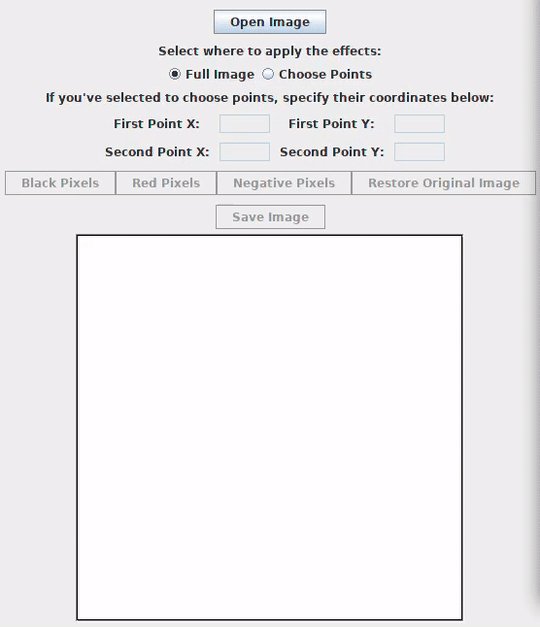
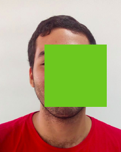

Negative andre
##############

:date: 10-21-2018 18:23
:modified: 10-21-2018 18:23
:tags: java; swing; opencv; dip
:category: digital image processing
:slug: negative-opencv
:authors: Andre Fellipe da Silva
:summary: An application that changes pixels values in an image using the OpenCV library. This post was written to the sound of U2's War_. You can listen one of the songs here_.

Good news, everyone: I'm running again. I've restarted yesterday and I hope to continue for a long time. It's been a while, so I'm taking it easy.

With this great news in mind, let's talk about how we can work with pixels using the OpenCV library. Today's application is called **Playing with Pixels**. Here's what the user can do with it:

* Open an image from his file system;
* Choose a region or the whole image to apply operations;
* Change all of the pixels of the selected region to black;
* Change all of the pixels of the selected region to red;
* Change all of the pixels of the selected region to its color's complement;
* Restore the original image;
* Save a new image with one of the operations applied.

You can see the **Playing with Pixels** application in action below:

Wow! There's a lot of noise in this **.gif**.

Anyway, in this post, I won't explain everything step-by-step like previously. You can take a look at this link_ to see how I've created the user interface. To make things shorter, I will only explain parts of the most important methods.

Determining the Region of Interest
==================================

A region of interest (ROI) is a part of an image that we want to operate on. We can use any polygon to create ROIs. Here, we're using a rectangle. The user can choose the coordinates of the first point, the upper-left corner of the rectangle, and of the second point, the lower-right corner of the rectangle. If the user doesn't want to choose the points, the full image will compose our ROI. The radio buttons on the interface inform us what the user wants.

Also, to make it a more smooth user experience, we validate the user's input in the fields to make sure that he has chosen a valid positive integer (the **getValueFromField()** method is responsible for this) and that this number is a valid pixel of the image (you can't choose the pixel in row 3000 and column 2000 if the image's resolution is 500x500).

Let's take a look at the code that does what was described:

.. code-include:: ../../dip/src/Exercise02.java
    :lexer: java
    :encoding: utf-8
    :tab-width: 2
    :start-line: 628
    :end-line: 690

Our rectangle is created with the help from an object from the Rect_ class. We use its constructor to create a rectangle with the vertices defined by the chosen two points.

To get our ROI, we create a new object from the **Mat** class, **roiMat**. This object is created by using a constructor_ from the **Mat** class that allows us to pass a **Mat** object and a **Rect** object. The result is only the content from the **Mat** that resides in the area defined by the **Rect**. If the chosen points were (0,0) and (10,10), our **roiMat** would be a 10x10 square with the content of the original image from this exact area.

As we did previously, we need to pass the content from the ROI to a byte array, our good old **buffer**, a process that we've seen here before.

The following code creates our ROI and pass its content to our **buffer**:

.. code-include:: ../../dip/src/Exercise02.java
    :lexer: java
    :encoding: utf-8
    :tab-width: 2
    :start-line: 691
    :end-line: 707

Changing the pixels of the ROI
==============================

In our application, we store the information about which button the user clicked with the **buttonChosen** **String** and use it as the key to a **switch** statement to determine what should be done. If the user wants to show it back the original image, we only need to assign our **currentImage** **Mat** object to the **originalImage** object that we made sure it wasn't going to be altered in any circumstance. In the other cases, we need to alter the pixels in our buffer and then put it back in the **roiMat** before showing it again on the screen.

To alter the pixels, we can use one of the two helper methods: **changePixelsColor()** and **changePixelsToNegative()**. The first one will be used if we want to change the **roiMat** pixels to a single color (in this case, black or red). The second one will be used if we want the find the negative of the ROI.

This piece of the puzzle can be seen here:

.. code-include:: ../../dip/src/Exercise02.java
    :lexer: java
    :encoding: utf-8
    :tab-width: 2
    :start-line: 708
    :end-line: 749

The Java unsigned problem
=========================

If you've worked with Java before, you should know that this programming language doesn't have an unsigned data type. For instance, a byte_ data type is an **8-bit** signed two's complement integer. It can represent a number from **-128 to 127**. If we're working with **8-bit** images and representing the values in a byte array, how are we going to put the value **200** if a byte in Java can't represent this number?

The answer isn't so trivial, but it's a simple one.

First, we're going to take our byte and use the **AND** operator with the number **0xff**. **0xff** is the hexadecimal **FF**, which is an integer of value **255**. Its binary representation is **00000000000000000000000011111111**, a **32-bit** integer (int data type in Java). When we do this, we have a **32-bit** number where the last **8** bits are our desired value and the rest is **0**. This means that we can do operations between integers and cast it back to a byte to put it in the array.

Changing the values in the buffer
=================================

In the case of the **changePixelsColor()**, this method receives an int array of length three where each position represents the value from each channel. The first position contains the blue channel, the second has the green channel and the third has the red channel. If we want the color red, we pass it **new int[] {0, 0, 255}**.

Inside the method, we iterate through the **buffer** and put the values of the desired color in the channels. To change it to a black pixel value, we pass **new int[] {0, 0, 0}**. For green? **new int[] {0, 255, 0}**. For a color that I don't know? **new int[] {31, 200, 109}**.

The **changePixelsToNegative()** method is a little different, but not much. The negative color of a color is its complementary color.

Wow, that's a lot of colors.

Don't worry! This value is the distance between the color value and **255**. In this case, we need to get the current value in the **buffer**, find the distance to **255** and replace the value in the **buffer**.

Here's the code:

.. code-include:: ../../dip/src/Exercise02.java
    :lexer: java
    :encoding: utf-8
    :tab-width: 2
    :start-line: 752
    :end-line: 793

And I guess that's it! I hope that you've enjoyed today's post. Before I go, let's just see what color is **new int[] {31, 200, 109}**:

Awesome!

.. _War: https://en.wikipedia.org/wiki/War_(U2_album)
.. _here: https://www.youtube.com/watch?v=EM4vblG6BVQ
.. _link: https://github.com/andrefellipe/dip/blob/master/src/Exercise02.java
.. _Rect: https://docs.opencv.org/3.4/javadoc/org/opencv/core/Rect.html
.. _constructor: https://docs.opencv.org/3.4/javadoc/org/opencv/core/Mat.html#Mat-org.opencv.core.Mat-org.opencv.core.Rect-
.. _byte: https://docs.oracle.com/javase/tutorial/java/nutsandbolts/datatypes.html
