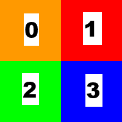

The 24 Canucks
##############

:date: 10-23-2018 00:15
:modified: 10-23-2018 00:15
:tags: java; swing; opencv; dip
:category: digital image processing
:slug: swap-regions-opencv
:authors: Andre Fellipe da Silva
:summary: An application that swaps rectangular regions of an image using the OpenCV library. This post was written to the sound of Pavement's `Crooked Rain, Crooked Rain`_. You can listen one of the songs here_.

A question before we start: is Pavement the greatest band ever?

A difficult question, sure, but one we have to answer somehow. And, of course, the answer is:

Quite possibly, **yes**.

Now that we've got this extensive discussion out of our systems, let's talk about how we swap regions of an image using the OpenCV library. Let's call it.\.\. **The Swapper**.

**Writer's note**: I've watched `The Player`_ recently and this title is my terrible homage to this great movie.

Here's what the user can do with it:

* Open an image from his file system;
* Randomly swap the quadrants of the image;
* Swap the quadrants of the image selecting a personalized layout configuration;
* Restore the original image;
* Save a new image with one of the operations applied.

You can see **The Swapper** in action below:

.. image:: images/05-01-TheSwapperDemo.gif
  :alt: Animated .gif that shows the user opening an image, swapping its regions and saving the new image.
  :align: center

To develop this application, we need to know a little about the ArrayList_ class and the concatenation of **Mat** objects with the OpenCV library. There's a lot of different ways to swap the regions. I've chosen this one for **The Swapper** for no particular reason.

The odd image problem
=====================

Before we talk about changing regions of the image, we must solve an improbable, but possible problem. What if our image has an odd number of rows or columns? This would mean that the regions would not have the same amount of pixels with the division of the quadrants. Such situation can make the swap more difficult. To make things simpler, we first check if the image has an odd number of rows or columns and, if that's the case, we add a padding to make sure that everything is even.

As you can see below, we do this with the `copyMakeBorder()`_ method:

.. code-include:: ../../dip/src/Exercise03.java
    :lexer: java
    :encoding: utf-8
    :tab-width: 2
    :start-line: 541
    :end-line: 544

Respecting the user's choice
============================

In our application, we have two ways to choose how to swap the regions of the image: one is random and another is doing it ourselves. In both cases, we will fill an **ArrayList** object named **regions** with numbers from 0 to 3 where each one represents one region and its position reflects the quadrant where we want to put the region. Take a look at the picture below:

The numbers can be seen as the regions in the **ArrayList** object and the squares are the quadrants. If we have a **regions** object with elements (1, 0, 2, 3), we're swapping the content of the regions in the upper half of the image.

To perform a random swap, we add 0, 1, 2 and 3 to **regions** and then shuffle it with the `shuffle()`_ method from the Collections_ class to get a random order.

In the other case, we only need to check if the user's input is valid and get the values to the **regions** object.

Here's the code to do this part:

.. code-include:: ../../dip/src/Exercise03.java
    :lexer: java
    :encoding: utf-8
    :tab-width: 2
    :start-line: 544
    :end-line: 569

Choosing the right points
=========================

We're going to need five **Point** objects (**origin**, **middle**, **lowerLeftCorner**, **upperRightCorner** and **lowerRightCorner**) to create the four **Rect** objects, each one with the points, from where we're going to create our **Mat[]** object with the four regions. Here's how to do this:

.. code-include:: ../../dip/src/Exercise03.java
    :lexer: java
    :encoding: utf-8
    :tab-width: 2
    :start-line: 570
    :end-line: 588

Concatenating the situation
===========================

We need to concatenate the elements of the **imageRegions** object and put together the swapped image at the end. In our case, since there are four quadrants that we're working on, we will first create a **List<Mat>** object called **upperHalfMatList** to contain the first two quadrants (upper left and upper right of the image), then concatenate these two together in a **Mat** called **upperHalfImage**. Next, we do the same process to the lower quadrants using **lowerHalfMatList** and **lowerHalfImage**. To end, we concatenate vertically **upperHalfImage** and the **lowerHalfImage** to generate our swapped image in the **currentImage** object.

Here's how everything comes together:

.. code-include:: ../../dip/src/Exercise03.java
    :lexer: java
    :encoding: utf-8
    :tab-width: 2
    :start-line: 597
    :end-line: 627

Booyah! Another cool exercise done with the OpenCV library. By the way, there are 24 combinations that can be done with the permutations, so that's where the post's title came from.

.. _`Crooked Rain, Crooked Rain`: https://en.wikipedia.org/wiki/Crooked_Rain,_Crooked_Rain
.. _here: https://www.youtube.com/watch?v=lPvhKV3Yg2k
.. _`The Player`: https://en.wikipedia.org/wiki/The_Player_(film)
.. _ArrayList: https://docs.oracle.com/javase/10/docs/api/java/util/ArrayList.html
.. _`copyMakeBorder()`: https://docs.opencv.org/3.4/javadoc/org/opencv/core/Core.html#copyMakeBorder-org.opencv.core.Mat-org.opencv.core.Mat-int-int-int-int-int-
.. _`shuffle()`: https://docs.oracle.com/javase/10/docs/api/java/util/Collections.html#shuffle(java.util.List)
.. _Collections: https://docs.oracle.com/javase/10/docs/api/java/util/Collections.html
