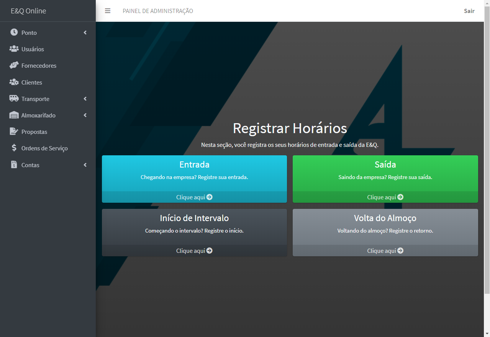
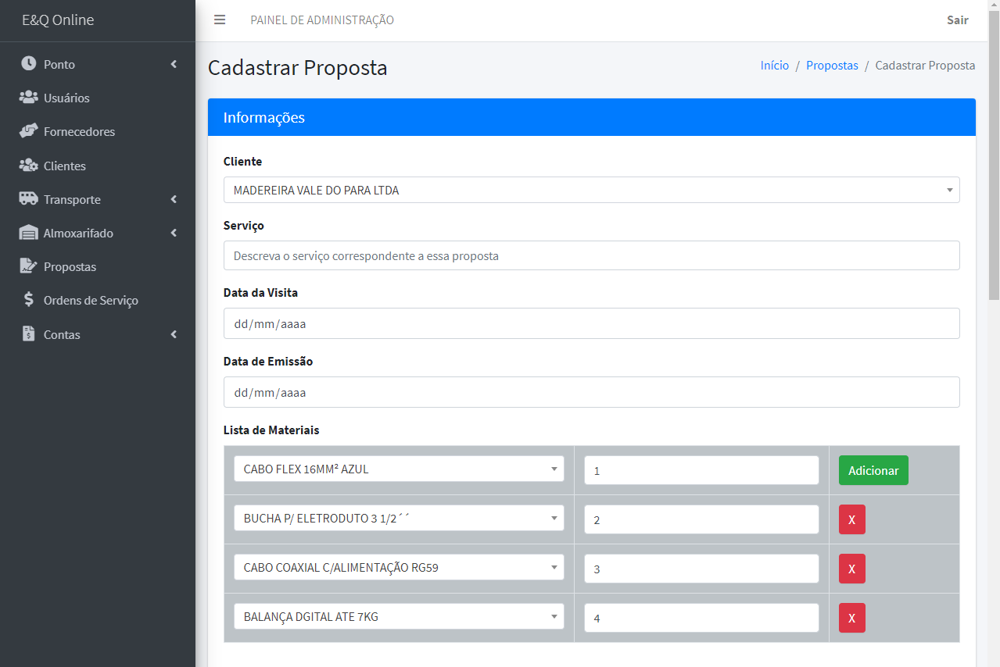

E&Q Online
##########

:date: 2019-05-01 17:00
:modified: 2019-05-01 17:00
:tags: freelance, html, css, javascript, php
:category: portfolio
:slug: eq
:authors: Andre Fellipe da Silva
:summary: A brief description of one freelance project I've just did and how it came about. This post was written to the sound of The Clash's `London Calling`_. You can listen one of the songs here_.

During the first semester of 2018, I was an intern at a small local company. The company's name is `Engenharia & Qualidade`_ and it has been around for more than two decades. It has 10 employees as of May/2019, including the two main partners, and a long range of services that goes from structured cabling to studies of grounding and soil resistivity testing of substations. Basically, the company can solve anything in the fields of electrical installations and telecommunications thanks to the expertise of its two owners. Its major client is one of the biggest (if not the biggest) supermarket chains of my state, Nordestão_.

In my internship, I was responsible for the budgets and, sometimes, the supervision of the execution of some projects. As you may already know, there was a lot of Excel and AutoCAD involved. It was a brilliant experience, but, after my six months there, I came to the conclusion that this would not be something that I would like to do for a living.

I decided to not renew my contract after one semester. During my time there, I automated a lot of the tasks on the spreadsheets that the company had, but there was a gap because we used a lot of different management tools. Excel for the budget, an old software made with VB to manage the clients and the warehouse, a physical book that the employees signed with the worked hours, etc. One of my ideas after dealing with all of that was to replace everything with something that could unify everything the company did.

I wasn't able to implement the system while I was an intern because my actual job (budgets and supervision of projects) didn't allowed me the time. This year, however, I approached the owners with this idea and they thought it would be great if I developed a website with all of necessary functionalities. We agreed on a price and, during the months of march and april, I've developed E&Q Online, a website hosted at the company own server to internal use.

This is the login screen:

And this is the homepage after the user logs in:

Thanks to the agreement between me and the owners, I am going to be very selective of what parts of the website I am going to discuss here.

As you can see, there's nine areas in the platform: **Log**, **Users**, **Suppliers**, **Clients**, **Transport**, **Warehouse**, **Proposals**, **Orders** and **Accounts**. Let's do a brief rundown of each:

Log
===

Here, the users can register when they arrive at the company, when they go out to lunch, when they return and when they leave. Also, the users are able to register any missing day. The users in the **Administrator** category can see, update or delete the records and missing days from all of the users. If the user is not a part of this category, he can only see his own records.

Here's the screen where the user can choose what's the type of logging that he's doing it:

If the user chooses the first option, he's going to register that he has arrived at the company. After the confirmation, a new record is created with the current timestamp.

As I said before, an administrator can see all of the records in a very friendly manner. He's able to search for any record by using any parameter (the name of the user, the date, the type of entry, etc) and he can update or delete any record:

The user can also create a record of absence if he missed a day:

And an administrator can see all absences. In this particular print, there isn't one registered yet.

Users
=====

In the Users section, an administrator can create, update or delete an user:

.. image:: images/06-08-EQ-08.png
  :alt: The screen where the user can see all registered users.
  :align: center

Also, as you can see, the users can alter their passwords. An important part of the **Users** section is that every week an email is sent to the administrators with the due date of the users' documents. This is relevant because they can see when the document is going to expire and renew it at the right time. Before E&Q Online, the company was not used to keep track of the due dates. So, when a project showed up, part of the workforce would not be able to work because some certification was expired. Right now, the administrators receive a list informing how many days are left, as you can see below:

.. image:: images/06-09-EQ-09.png
  :alt: Example of the email that the administrators receive with the users' documents and their due dates.
  :align: center

Clients and Suppliers
=====================

These two sections are basically the same. Create, update and delete the clients and the suppliers of the company. It's worth nothing that one of the most annoying parts of the project was finding out how to retrieve the database already in use in the old software to put it on the website. There where more than one thousand clients and suppliers combined in the old database and the data was in a different setup than the one that we need here, since we'll be connecting these clients and suppliers to other parts of the website. Importing the data from the Access database to the MySQL one that the site uses took almost a full afternoon of work.

.. image:: images/06-10-EQ-10.png
  :alt: The screen where the user can see all registered suppliers.
  :align: center

Transport
=========

This section is divided in **Vehicles**, **Travels**, **Refuels** and **Maintenances**. Here, we can create, update or delete each one of those things. Below you can see a screenshot of a refuel where the gas station listed is from the registered **Suppliers** section:

.. image:: images/06-11-EQ-11.png
  :alt: The screen where the user can see all registered refuels.
  :align: center

An old problem that has been solved is related to the inspections of the tools that are in the cars. Since the workers are in movement everyday, they need to keep equipment from the warehouse inside the cars and the company needs to ocasionally check if everything that was taken from the warehouse is in the car. If, for instance, a worker loses a screwdriver, the company needs to know and charge him for the slip. That's why in the **Vehicles** section each vehicle has an inspection button where the user (generally it's the job of an intern to do the inspection) can see a list of the current tools there and check if everything matches. The list of current tools is automatically generated, a feature that we will see in the following section.

Warehouse
=========

The warehouse has more than 1.500 products and tools that the company can sell or use in a project. Here, we can basically create, update or delete a product, move the project, keep track of every movement and generate the SPED report, a list with the products and important information that the company needs to send every year to the *Receita Federal*, our version of the IRS.

As you can see below, there's three important buttons to move products around.

We can make the products go in the warehouse (if we buy a 10 meters of cable and add it to the warehouse, this is the option).

We can make products go from the warehouse to a service (if we need to take 3 meters of cable and use it in a project, this is the option), we can also make products go from the warehouse to a vehicle or a toolbox (as we kind of pointed out in the section before this one, this is how we keep track of the tools inside the vehicles).

And, in the third button, we can return products from a car, a toolbox or a service to the warehouse (if we took 3 meters of cable to use it on a project, but only needed one, we can return two so that we can appropriately charge the client only the one that was used).

.. image:: images/06-12-EQ-12.png
  :alt: The screen where the user can see all options in the Warehouse section.
  :align: center

In this example below, we are moving 20 meters of cable that will be used in a project registered (more about orders of service later):

.. image:: images/06-13-EQ-13.png
  :alt: An example of how to move a product out from the warehouse to a service.
  :align: center

As you can see in the screenshot below, all of these movements can be seen in this section of the website:

.. image:: images/06-14-EQ-14.png
  :alt: The screen where the user can see all registered movements.
  :align: center

We can also generate the data that the company has to send to the government every year. Here's a snippet of this report:

To finish, there's the **Toolbox** subsection, but it's very similar to the **Vehicles** one. You can create, update and delete toolboxes and make inspections of its contents.

Proposals
=========

This is the section where we develop the budgets for the services and generate business proposals to send the clients. It's also where we can add services and update their prices. If the company adds to its catalog of services, for instance, "Install photovoltaic panel" and charges R$ 1.000,00 per panel, we can add here so that we can use it in the proposal. Or, in another instance, if the price of "Certification Test for CAT. 6 cable" goes up, we need to update it so that we can make the more recent proposals with the new price.

To formulate a budget, we need to choose who is the client that we're sending the proposal and list all of the products and services that are needed to do the project. After that, the website calculates how much the material is going to cost, how much the services are going to cost, how much would it cost to do it during business hours and how much would it cost to do it out of the business hours (more expensive).

With all of the prices calculated, the user can create a business proposal to sent it via email to the client and generate lists with the materials and the services needed to this project.

.. image:: images/06-18-EQ-18.png
  :alt: The screen with an example of a proposal.
  :align: center

The example above is totally random.

Orders
======

If a proposal is accepted, when the workers go out to execute the project, we need to generate an order. This is what this section is all about. We can update the status of the order (if it's ongoing or if it's finished), we can generate a list with all of the products used in the order (based on the movements that we did at the **Warehouse** section) and we can print the order so that the workers can take it to the field and fill the informations that the company need.

.. image:: images/06-21-EQ-21.png
  :alt: The screen with an example of a list of materials that went out to the service.
  :align: center

Accounts
========

This section is simply about creating, updating and deleting accounts, meaning bills to pay and bills to receive. That's it. Just a few CRUDs.

Final Thoughts
==============

That's everything. I've tried to summarize the main points of this project. It's a basic, but very functional HTML, CSS, JavaScript, PHP and MySQL combo. There's a couple of libraries and plugins that helped a lot, like jQuery, Bootstrap, RainTPL, Composer, PHPMailer and a couple of others that I don't recall at this moment.

The expectation is that we can increase the company's productivity with the website and I'm very confident that this will be achieved.

If you want to know more about the details of the implementation, you can contact me at andrefellipern@gmail.com.

.. _`London Calling`: https://en.wikipedia.org/wiki/London_Calling
.. _here: https://www.youtube.com/watch?v=ertt3o1x65c
.. _`Engenharia & Qualidade`: https://www.engenhariaequalidade.com.br/
.. _Nordestão: http://www.nordestao.com.br/