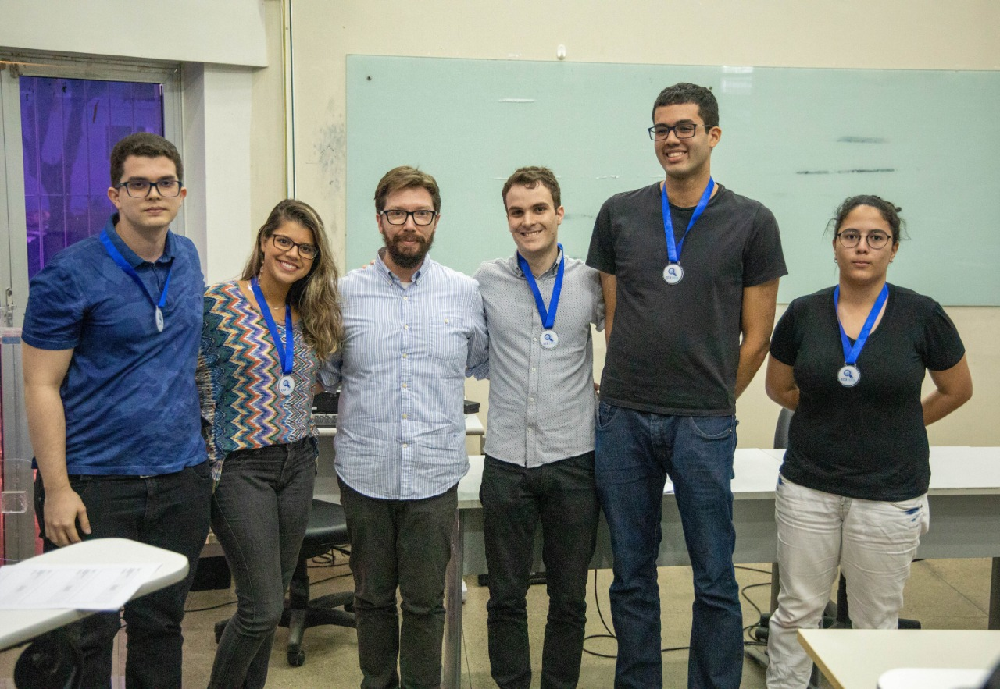

Is it just me, or is it hot in here?
####################################

:date: 2019-11-20 23:00
:modified: 2019-11-20 23:00
:tags: statistics, data science, python, ufrn
:category: portfolio
:slug: ufrn-data-science-comp-2019
:authors: André Fellipe
:summary: Let's talk about my first participation on a data science competition. This post was written to the sound of The Killers' `Hot Fuss`_. You can listen one of the songs here_.

A colleague of mine invited me to create a team to win the 2019 UFRN Data Science Competition last month. I've never participated in one before and I thought that it was a cool experience. Our five-person group had a couple of days to do any kind of analysis on meteorological data provided by INMET, the government agency responsible for this kind of stuff.

We had to move quickly and precisely to bring to the public a creative analysis of a lot of data - basically everything related to temperatures, humidity, wind and similar variables from 1961 to today from every part of Brazil.

We visualized the impact that this year's Amazon fires had on the data through geospatially visualizing temperature differences according to a baseline, running a PCA and investigating spatial patterns, and forecasting temperatures to look for anomalies. My job was to do the last part using this cool tool from Facebook called Prophet_.

Unfortunately, we came up short and got second place. I honestly believe that we should have won it and one member of my team even argued with the judges a little bit, but to no avail.

It was a cool debut, though. Right now, we are getting prepared to try again in similar competitions.

The most unfortunate part of everything was the fact that when we got to the front to receive our medals, there were two cameras, one from one of the professors and the official one of the event. I didn't notice that and put my focus on the professor's one.

So, yeah, I look kind of stupid in the picture.

Jesus, sometimes I forget how tall I am.

The final presentation and all of the code can be found on GitHub. You can access it with this link_.

And through this one_, you can check out more information about the competition. If you know brazilian portuguese, that is.

PS: From left to right in the picture, we have André L., Ianca, Prof. Nunes¹, Vítor, *moi* and Mariana. We are the **weeee** team!

¹ Prof. Nunes was one of the judges.

.. _`Hot Fuss`: https://en.wikipedia.org/wiki/Hot_Fuss
.. _here: https://www.youtube.com/watch?v=gGdGFtwCNBE
.. _Prophet: https://facebook.github.io/prophet/docs/quick_start.html
.. _link: https://github.com/vitorsr/ccd
.. _one: https://marcusnunes.me/posts/resultados-da-competicao-de-ciencia-de-dados-da-ufrn-2019/
