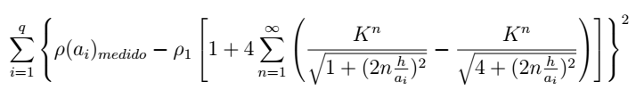
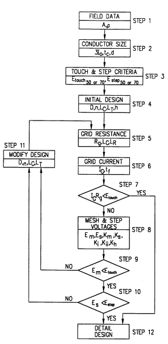

This is the end, beautiful friend
#################################

:date: 2019-12-01 15:30
:modified: 2019-12-01 15:30
:tags: matlab, python, ufrn
:category: portfolio
:slug: ufrn-final-project
:authors: André Fellipe
:summary: I've presented my final project at the university last week. This post was written to the sound of `The Doors'`_ eponymous album. You can listen one of the songs here_.

So, I'm only a few days away from officially becoming an electrical engineer. The final step was taken last thursday. I did my presentation and the professors loved it. One of the them even invited me to do my master's degree with him.

Here's the official photo:

.. image:: images/08-01-Final-Project-Presentation.jpeg
  :alt: Professor Max Chianca, myself and professor Marcos Dias.
  :align: center

If you didn't realized yet from older posts, I'm always the tall one.

My final project was a very easy one. Last july, during my Electrical Substations class, the professor suggested that developing a program to design grounding grids for substations alongside a tool for soil stratification would be a good idea for a final project. I thought to myself "Hey, I can do this very quickly" and I did it in two weeks.

Originally, I did it on MATLAB. In the beginning of september I think, I decided to develop an API using Django and put it up on Heroku. Then, I created a small form to consume the API and used Heroku again to leave it online.

The MATLAB and Python code can be found on GitHub_ and the live website is on this weird link_.

The math behind everything is not very difficult and I'm not going to dwell on it much. Basically, we have to minimize this function to do the soil stratification with two layers:

Also, there's a block diagram on the standard IEEE 80-2000 that I followed to check if the grounding grid has adequate touch and step voltages:

Even though this is not a difficult project, I liked because it was something that was done very quickly. I loved because I did it very early and had the time to focus on more important things for my career.

If you need a simple tool to do soil stratification and check if your rectangular grounding grid is safe, you're good to go.

This is it.

The end.

I'm a electrical engineer now.

Let's see what the future holds.

.. _`The Doors'`: https://en.wikipedia.org/wiki/The_Doors_(album)
.. _here: https://www.youtube.com/watch?v=BXqPNlng6uI
.. _GitHub: https://github.com/andrefellipe/esd
.. _link: https://grounding-design.herokuapp.com/index.html