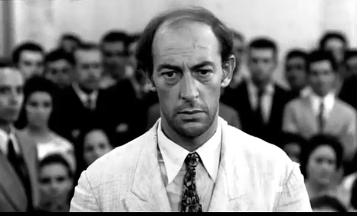

The Tech U Movies
#################

:date: 2020-08-09 06:58
:modified: 2021-01-23 23:36
:tags: amazon, aws, work, movies
:category: movies
:slug: tech-u-movies
:authors: Andre Fellipe da Silva
:summary: The first phase of the AWS Tech U Program is over. I saw 137 movies during the last 5 months and let's talk about 10 of them here. This post was written to the sound of `Paramore's`_ self-titled album. You can listen one of the songs here_.

This text is not about the **best** movies that I watched during this period. It's about movies that I thought that, for whatever reason, I should write about. All of them are interesting and I even rewatched a few before publishing this post, so you should absolutely check them out in case you are looking for recommendations.

**O Caso dos Irmãos Naves (1967)**
**********************************

.. class:: center

*"Here." - Multiple officers*

**Director:** Luís Sérgio Person.

**The plot:** A man disappear with a large sum of money and the investigation leads to one of the biggest mistakes in the history of Brazil's judiciary system. Two brothers are arrested and tortured to obtain a confession even though they did not commit the crime.

**Why is it here:** This is of the most gut-wrenching brazilian movies ever made. The torture scenes are intense and the police's lack of moral character puts the viewer in a uncomfortable position throughout 90 minutes.

**The scene:** The police forces one of the Naves brothers to search for the stolen money in an empty field. They know that there's no money to be found there and still torture an innocent man only to play with his mind.

**Twilight Zone: The Movie (1983)**
***********************************

.. image:: images/11-02-twilight.png
  :alt: Shot from the movie Twilight Zone, made in 1983
  :align: center

.. class:: center

*"Do you want to see something really scary?" - The Passenger*

**Director:** John Landis, Steven Spielberg, Joe Dante and George Miller.

**The plot:** A remake of three episodes of the original Twilight Zone.

**Why is it here:** The whole movie is uneven at best, but everything starts with a bang. The opening scene is a beautiful combination of humor, horror and homage to the original TV series. In the category "Movies that start brilliantly only to have not-so-great follow-ups", this one only loses to `When a Stranger Calls`_.

**The scene:** The opening scene where Albert Brooks and Dan Aykroyd discuss the most scary episodes of The Twilight Zone.

**Spoorloos (1988)**
***********************************

.. class:: center

*"But I want you to know, for me killing is not the worst thing." - Raymond Lemorne*

**Director:** George Sluizer.

**The plot:** A couple is travelling on holiday in France and while they stop to refuel, the girl enters to buy drinks and is never seen again. Her boyfriend enters a multi-year saga to find out what happened.

**Why is it here:** It has one of the most acclaimed endings in cinema history, but the movie as a whole offers much more. Spoorloos is a dense study about obsession and how humanity's dark side develops over time.

**The scene:** The ending sequence where we discover what happened.

**A Quiet Place (2018)**
************************

.. image:: images/11-04-quiet.png
  :alt: Shot from the movie A Quiet Place, made in 2018
  :align: center

.. class:: center

*"I love you. I have always loved you." - Lee Abbott*

**Director:** John Krasinski.

**The plot:** A family struggles to survive in a post-apocalyptic world where humanity must scape from monsters that are attracted to sound.

**Why is it here:** Because a well-made movie where the characters are not allowed to speak is an impressive feat. A Quiet Place creates incredible tension with the use of silence and shows that Krasinski is quite a skilled director, able to convey a thriller where the course of action for the characters is to avoid confrontations with the monsters instead of battling them.

**The scene:** The sacrifice scene.

**Hitman Hart: Wrestling with Shadows (1998)**
**********************************************

.. image:: images/11-05-hitman.png
  :alt: Shot from the movie Hitman Hart: Wrestling with Shadows, made in 1998
  :align: center

.. class:: center

*"Bret screwed Bret. I have no sympathy whatsoever for Bret." - Vince McMahon*

**Director:** Paul Jay.

**The plot:** A documentary following professional wrestler Bret "The Hitman" Hart during his final months in the World Wrestling Federation.

**Why is it here:** I've watched a ton of documentaries in the timeframe described above and chose two for this list. This one is here for a couple of reasons: it reminded me of 2008, when professional wrestling started to be broadcasted on network TV here in Brazil and I watched with my uncle, and also because it's a really underrated gem. This is a rise and fall story of a man that took pride in his profession, saw his boss as a father figure and was unable to adapt to his audience's newly-acquired preference in anti-heroes as protagonists instead of goody two-shoes personas. All of this and a company in financial peril culminated in a depressing night in Montreal.

**The scene:** After the movie's defining moment, the mind responsible for everything explains his actions on live television.

**Drag Me to Hell (2009)**
**************************

.. image:: images/11-06-hell.png
  :alt: Shot from the movie Drag Me to Hell, made in 2009
  :align: center

.. class:: center

*"I did what you said! I killed a little kitty!" - Christine Brown*

**Director:** Sam Raimi.

**The plot:** A loan officer chooses not to give an extension to the mortgage of an old lady. The lady in question is a gypsy woman with a blind eye and retaliates with a curse that makes the next few days of the protagonist's life a living hell.

**Why is it here:** Sam Raimi directed two of my favorite movie series, the Tobey Maguire Spider-Man movies (I know the third one is terrible) and Evil Dead, but those are the only movies of his that I watched before looking into Drag Me to Hell. This movie is a campy ride with some funny bits and weird horror sequences. The textbook definition of good, but not much more.

**The scene:** The fight scene in the garage.

**El Secreto de sus Ojos (2009)**
*********************************

.. image:: images/11-07-eyes.png
  :alt: Shot from the movie El Secreto de sus Ojos, made in 2009
  :align: center

.. class:: center

*"A guy can change anything. His face, his home, his family, his girlfriend, his religion, his God. But there's one thing he can't change. He can't change his passion." - Pablo Sandoval*

**Director:** Juan José Campanella.

**The plot:** A woman is raped and murdered and the characters involved in the investigation are followed through 25 years in a nonlinear narrative.

**Why is it here:** A modern classic from Argentina, El Secreto de sus Ojos deals with the theme of passion, showing its good and bad side in a beautiful love story and a twisted murder. Everybody in this movie is hiding something and Juan José Campanella shines in the direction with the lovely use of close-ups to bring the characters' eyes into the forefront. Since the eyes are the windows to the soul, nothing here stays hidden for too long and the result is a memorable journey through the years.

**The scene:** The chase inside *El Cilindro*. God bless the souls that filmed this sequence, an amazing achievement.

**Enron: The Smartest Guys in the Room (2005)**
***********************************************

.. image:: images/11-08-enron.png
  :alt: Shot from the movie Enron: The Smartest Guys in the Room, made in 2005
  :align: center

.. class:: center

*"We are the good guys. We are on the side of angels." - Jeffrey Skilling*

**Director:** Alex Gibney.

**The plot:** A documentary about the fall of the Enron Corporation.

**Why is it here:** After COVID-19 and the subprime crisis, it seems that the Enron scandal is something from another era, but it has been less than 20 years since what appeared to be an energy empire crumbled down in less than a month. This documentary really knows which buttons to push to make the audience angry with the multiple crimes committed. The way that Alex Gibney peels the onion and makes you angrier and angrier with the actions of Enron makes this a must-watch documentary.

**The scene:** A lineman from a power company that Enron bought learns that his retirement fund went from $250,000 to $1,000. He'll never retire.

**Spirited Away (2001)**
************************

.. class:: center

*"I promise I'll get you out of here, just don't get any fatter or they'll eat you." - Chihiro Ogino*

**Director:** Hayao Miyazaki.

**The plot:** A 10-year-old girl enters the world of spirits after her parents are turned into pigs by a witch.

**Why is it here:** It's the japanese Alice in Wonderland and Miyazaki shows us once again how beautiful hand-drawn animation is. Spirited Away is more than a movie, it's an experience.

**The scene:** The ride in the train.

**The Apartment (1960)**
************************

.. class:: center

*"Shut up and deal." - Fran Kubelik*

**Director:** Billy Wilder.

**The plot:** An insurance clerk allows senior coworkers to have affairs in his apartment to help him climb the corporate ladder. He's also in love with the building's elevator girl.

**Why is it here:** The Apartment goes deeper than the average romantic comedy. It's funny? Yep. The leads have amazing chemistry? Absolutely. But there's just a hint of sadness and loneliness injected in this group of broken characters that pushes this movie over the line, making it one of the best and most rewatchable films ever made. It meshes all of these elements so naturally and with such delicacy that even the absurd premise sounds like a normal day at the office.

**The scene:** The ending. A lot of romantic comedies end in similar fashion. They end this way because of the brilliance of this movie final sequence.

That's it. I'm interested in watching more movies in the near future. I wrote movie and TV reviews during my teen years and it has always been a pleasure of mine. While adult life limits my time to write extensive reviews, I plan to add some sort of frequency to my posts here and quick texts about movies are a good alternative. Let's see what the future holds.

.. _`Paramore's`: https://en.wikipedia.org/wiki/Paramore_(album)
.. _here: https://www.youtube.com/watch?v=OblL026SvD4
.. _`When a Stranger Calls`: https://www.youtube.com/watch?v=HVy-TSs7Gio