Spider-Man: The Animated Series (Season 01)
###########################################

:date: 2021-01-30 22:34
:modified: 2021-01-30 22:34
:tags: tv, spider-man
:category: tv
:slug: spider-man-season-one
:authors: Andre Fellipe da Silva
:summary: Spider-Man is my favorite superhero and the 1994 TV series was my introduction to the character as a young child. I decided to rewatch the first season and this is a short review of all episodes. This post was written to the sound of Weezer's `Blue Album`_. You can listen one of the songs here_.

It's said that your personal experiences make up a small part of what's happened in the world but maybe 80% of how you think the world works*. **Spider-Man: The Animated Series (TAS)** was the first television show that I religiously followed. I don't even remember my age at the time, but it used to be shown on network TV during weekdays in the morning and I anxiously waited for every episode. Thanks to this series and the fact that I do not follow comic books, my idea of Spider-Man is the version of the story presented here. I'm really excited to write these small bits here, so let's get started...

*\*This also explains why I prefer the movie version that Sam Raimi did instead of the more recent installments, with the exception of the terrible Spider-Man 3, since they are more aligned with this version. Mary Jane Watson >>> Gwen Stacy.*

Bob Richardson directed all episodes.

**Night of the Lizard**
***********************

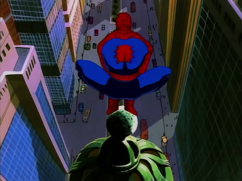

.. class:: center

*"What a slimy mess. Why can't I be one of those galaxy hopping superheroes? Why do I end up in the sewers? You don't find the Fantastic Four in the sewer. Or the Avengers. Never do you find the Avengers in the sewers. Or the Defenders. Well, maybe the Hulk." - Spider-Man*

**Written by:** Gerry Conway, Stan Berkowitz and John Semper.

There's no origin story here. Spider-Man is thrown right into the action to deal with a gigantic reptile that is attacking people in the sewers of New York City. He learns that the creature is his professor and friend Dr. Curt Connors, that used the Neogenic Recombinator to grow back his arm before the equipment turned him on the Lizard.

The pilot is a solid episode. All of the usual suspects, J. Jonah Jameson, Aunt May and Eddie Brock are here and plot elements that will become major parts of the story - like the previously mentioned Neogenic Recombinator - are introduced. This is a good start that shows the difficult financial situation of the Parker family, the bad public perception that Spider-Man has thanks to Jameson and how it's difficult for Peter to balance his life with his responsibilities as a superhero. Everything is packed in twenty minutes on small doses to establish the characters and humor plays a big part, like with the quote above when Spider-Man is in the sewer to fight the Lizard.

**The Spider Slayer**
*********************

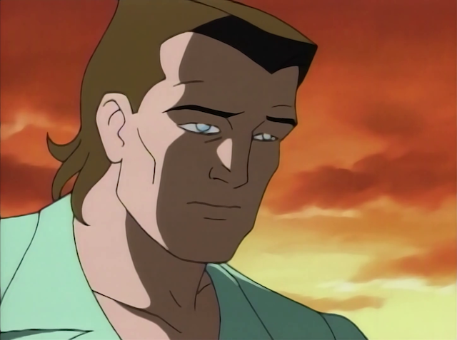

.. class:: center

*"I don't stick to walls, see? I can't swing on webs, either. I get airsick." - Flash Thompson*

**Story by**: John Semper.

**Teleplay by**: Stan Berkowitz.

Considering the target audience, **Spider-Man: TAS** goes deep in terms of serialized storytelling, small bits of information that don't seem important eventually comes back and the plots get more and more interesting with time. The multi-part episodes are important in this context because it allows the narrative and the characters to be fleshed out in the appropriate pace. This is the first part of the first one that the series made. Since we're early in the series run, we're being slowly introduced to the big players and it's interesting to see how naturally Spider-Man makes enemies. This episode introduces Kingpin, Norman Osborn, Spencer Smythe and Alistair Smythe and their plan to take out the webslinger using robots while Eddie Brock continues his quest for revenge. Also, Felicia Hardy and Flash Tompson show up in a weak subplot where the football player dresses as Spider-Man to scare Peter in Felicia's party.

The episode tries to placate too many moving pieces at the same time. It does not hit home runs in all of them and the Black Widow is never showed as a real threat to Spider-Man. A forgettable effort.

**Return of the Spider Slayers**
********************************

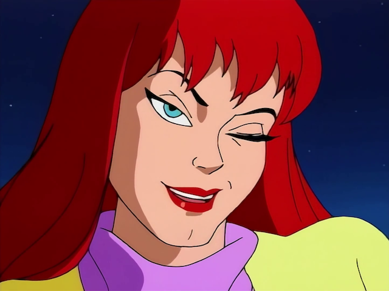

.. class:: center

*"Face it, Tiger. You just hit the jackpot." - Mary Jane Watson*

**Story by**: John Semper.

**Teleplay by**: Mark Hoffmeier.

This was a weird story to tell in a two-part episode. While the previous episode was not a hit, the story of Alistair Smythe aligning himself with the Kingpin is good enough to warrant a continuation, but not exactly right after his father is killed. It would made more sense if the writers did the follow-up later instead of here because this episode was very similar to the first part. Smythe sends robots to attack Spider-Man and everyone involved in **The Spider Slayer**. Rinse and repeat. There's also a bomb that will detonate in one hour attached to our hero for whatever reason.

Weirdly, the best moment of the series so far comes here: the first appearance of Mary Jane Watson. Just like the comics, she appears at the end to utter her famous line. I guess Peter will change his opinion of blind dates now.

**Doctor Octopus: Armed and Dangerous**
***************************************

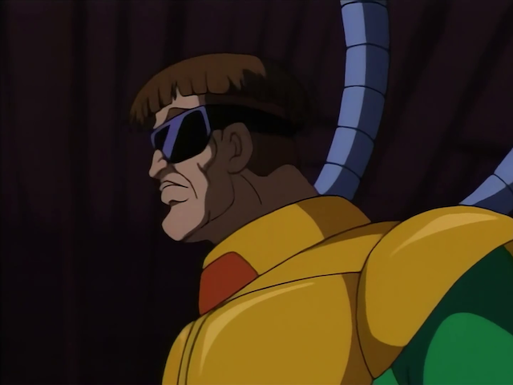

.. class:: center

*"Reminds me of Flash Thompson, all hands." - Felicia Hardy*

**Story by**: John Semper and Brooks Wachtel.

**Teleplay by**: Brooks Wachtel and Cynthia Harrison.

The best episode of the season so far and we're already seeing the slow introductions to the characters return dividends. Dr. Octopus debuts and his origin story is well presented with the use of flashbacks. The best villains are normally the ones that truly believe that what they're doing is for the greater good and Dr. Octopus is positioned as such here, obsessed with his experiment and kidnapping Felicia Hardy to get revenge on the Hardy family for refusing to support his work and to obtain money to fund it.

The script meshes well the protagonist's personal relationship with Felicia alongside his superhero work. Using Peter Parker as the person that delivers the ransom money is a good idea that comes off naturally on screen and the fight scenes between Spider-Man and Dr. Octopus are crafted in a convincing fashion, playing it off the fact that it's two highly-intelligent individuals using their brains to get one over the other. All of the characters are used correctly - even J. Jonah Jameson getting kidnapped because of his mouth makes total sense - and adds up to great twenty minutes.

**The Menace of Mysterio**
**************************

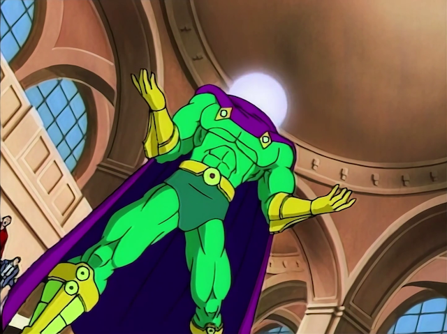

.. class:: center

*"I had the power and I didn't use it. I lost my uncle because I ignored my responsibilities. He always used to tell me: with great power comes great responsibility. If I stop being Spider-Man, who else will suffer?" - Peter Parker*

**Written by**: John Semper, Marv Wolfman and Stan Berkowitz.

Mysterio shows up in a plot to frame Spider-Man for a series of robberies while positioning himself as a hero with the help of J. Jonah Jameson. The webslinger has to redeem himself and Peter Parker questions if it's worth it to be Spider-Man since in the whole situation he forgets about his date with Mary Jane.

In this episode we also see one of the main components of the Spider-Man story being brought up for the first time: the murder of Uncle Ben and his importance to the character of Peter Parker. The way the flashbacks and the Mysterio story connect is well done and we can really feel the doubts that Peter has. Is it worthy to sacrifice so much and get so little in return? Maybe not, but running away from the responsibility is a worst option. This dilemma drives the episode and continues the good streak for the series.

**The Sting of the Scorpion**
*****************************

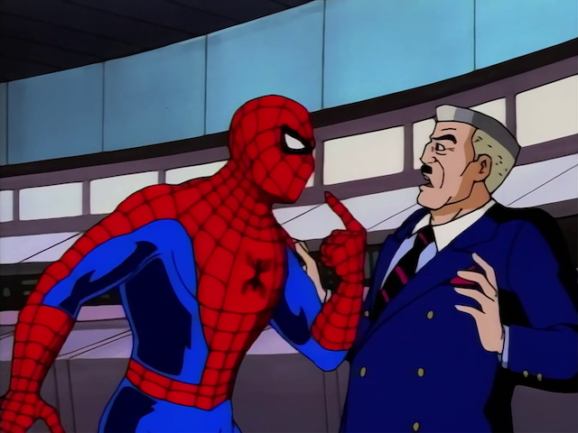

.. class:: center

*"I knew I should have never left Brooklyn." - Scorpion*

**Written by**: John Semper, Marv Wolfman and Stan Berkowitz.

J\. Jonah Jameson hires a low-level crook named Marc Gargan with self-steem problems to follow Peter Parker and find out about his relationship with Spider-Man. After his plan fails, he talks to Professor Farley Stillwell to use the Neogenic Recombinator to transform Gargan in a "hero" to take out Spider-Man. Scorpion is born and goes on a rampage all over New York City.

For a cartoon that has only twenty minutes to tell a story, **Spider-Man: TAS** puts a lot of effort in providing motivations and personalities to every character to makes us sympathize with them. We learn why Jameson hates our hero thanks to a mob hitman with a mask killing his fianceé and pushes him into a more gray area than the position as the series' main villain that he was put previosuly. Even Gargan has certain deep traits for such a simple character, his insecurities associated with the radiation from the Neogenic Recombinator drive him insane and character details like this gives an important spotlight to the supporting players. The episode is a good showing and important because shows that the writers are comfortable and capable to create an universe where there are people outside of Peter that are relevant.

**Kraven the Hunter**
*********************

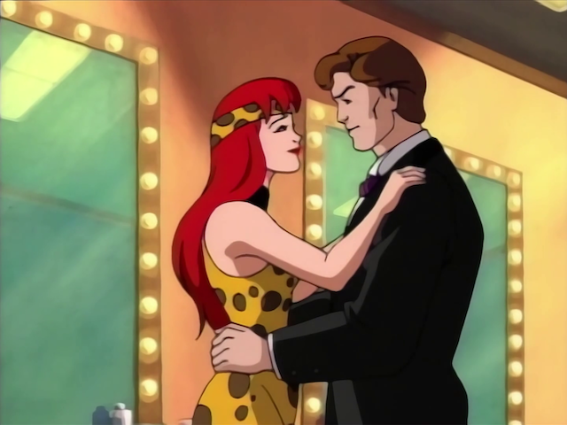

.. class:: center

*"Welcome to my jungle." - Kraven*

**Story by**: John Semper and Jan Strnad.

**Teleplay by**: Mark Hoffmeier.

One thing that **Spider-Man: TAS** did so well in such short amount of time was establish the characters in a convincing manner... until this episode. Spider-Man takes a backseat to a boring love story that serves as the introduction of Kraven the Hunter, a superhuman that was saved by Dr. Mariah Crawford using a drug called the Calypso Serum. He attacks her and kidnaps Robbie.

All of these three characters are not that well positioned in the series' universe to warrant that much time to their story and Spider-Man is a spectator to all of the action. Sure, he fights crocodiles, but he doesn't drive the narrative. And thanks to the amount of time devoted to the kidnap and the love affair, Peter's subplot where he has to ignore Mary Jane and Felicia Hardy just sounds thrown together at the last minute.

Basically, a safari with a corny villain that ends with Kraven getting an antidote. The weakest installment of the season.

**The Alien Costume, Part 1**
*****************************

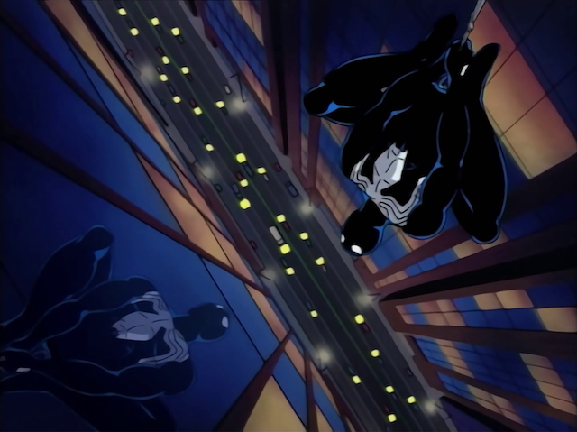

.. class:: center

*"Parker, how on Earth did you get in the middle of Manhattan, hanging upside down in a costume you've never seen before?" - Spider-Man*

**Story by**: Avi Arad and Stan Lee.

**Teleplay by**: Len Wein, Meg McLaughlin, Stan Berkowitz and John Semper.

The three-part episode that brings this series to another level starts here. The Symbiote - and you know who - is one of the most iconic villains of Spider-Man and the narrative here does justice to the character. The best part of the script is that all of the elements that served as pillars of the series so far - Peter's frustation with the lack of recognition he has, J. Jonah Jameson positioning Spider-Man as public enemy number one, Kingpin doing shady deals and Eddie Brock getting screwed - all come together. Also, we get Rhino smashing things and stealing the Promethium X for Kingpin.

This first part has an accelerated pace and gives the necessary substance to each character. It's interesting that it doesn't have subplots or other stories and every major player is gunning for something different inside the same plot.

A great start to this multi-part episode and Peter slow descent into madness - almost killing Rhino - thanks to the Symbiote only gets weirder next.

**The Alien Costume, Part 2**
*****************************

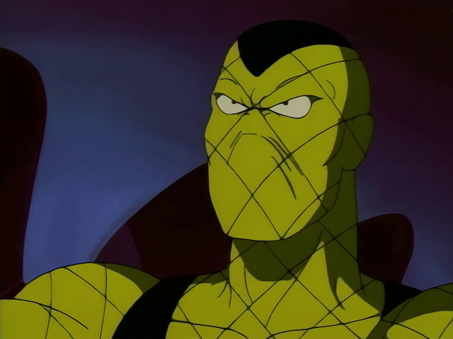

.. class:: center

*"You're suppose to be the good guy. You can't do this!" - Shocker*

.. class:: center

*"Why not? I have the power." - Spider-Man*

**Story by**: John Semper and Brynne Stephens.

**Teleplay by**: Brynne Stephens.

Peter's new suit makes him more and more violent while he has to deal with Jameson's bounty. After he learns more about the nature of the suit, he realizes that keeping it may not be the best course of action for his well-being.

While the first part ends with Peter having second thoughts about hurting Rhino, this one ends with the Symbiote assuming the control and almost killing Shocker, our newest addition to the rogues' gallery. Thank goodness, our hero recovers his conscience and reminds himself of the wise words of Uncle Ben. The seamless transformation to insanity of Spider-Man is the main point here and the fits of rage that he throws - including a corny one while chasing Shocker in a church - provides us with great action.

Meanwhile, Jameson has to eat his words and get Spider-Man's help to deal with the kidnap of his son - come to think of it, kidnappings are a common thing in this show - and the writers once again throw him in this uncomfortable position of needing aid.

In his most difficult test so far, Peter has to battle to remember that he's a good person and this story arc continues to prove his fame as the best of the first season.

Oh, and, once again, Eddie Brock gets the short end of the stick. But now he has a new friend to cope with his bad fortunes...

**The Alien Costume, Part 3**
*****************************

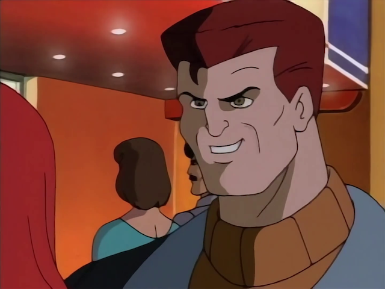

.. class:: center

*"You'll see us everywhere, even in your nightmares." - Venom*

**Story by**: John Semper and Mark Hoffmeier.

**Teleplay by**: Mark Hoffmeier.

The best episode of the first season and the end of a story arc that proves that **Spider-Man: TAS** is a very mature show for a cartoon. Eddie Brock finally has the means to get revenge on Spider-Man throught the Symbiote. Venom appears and torments Peter's loved ones. The script does a great job at raising the stakes of the confrontation, as Venom knows the webhead's identity and is so consumed by hate that he doesn't think twice before using this knowledge to make Peter suffer. We go through twenty minutes where the villain doesn't stop messing with Peter's head and body, putting the hero in a position where he's outthought and outfought the whole time, even having his mask removed, an opportunity that J. Jonah James can't capitalize on. We jump from one scene to next expecting a breather or a transition to a different scenario, but, nope, there's Venom on top again beating up Spider-Man.

This story arc is impressive because Peter gets to show a lot of different emotions in each episode, from overconfidence to helplessness. Here, it's palpable the fear that he has that Venom can harm Mary Jane and Aunt May and this has him on the brink before being able to use his intelligence to defeat the enemy. All of this is served with great action sequences - the final fight goes on in more than three locations - and a nice ending with him finally having a moment with Mary Jane while they look at the night sky.

**The Hobgoblin, Part 1**
*************************

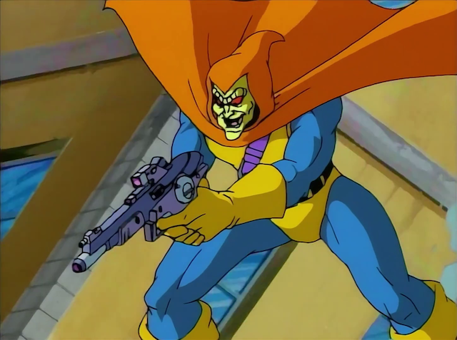

.. class:: center

*"I want the Kingpin." - Hobgoblin*

**Written by**: Larry Brody and John Semper.

Introducing the Hobgoblin here is the most questionable decision of the first season considering that it's a completely different approach than the comics. In this two-part episode, that decision may alienate some fans, but it doesn't prevent the story from being fun. The villain appears in a random fashion, but the narrative of a three-way dispute between the Kingpin, Norman Osborn and the Hobgoblin with Spider-Man - and Peter - getting caught in the middle provides us with an episode full of action and double crosses.

This is a weird episode because it doesn't care much about providing a backstory to the main villain, trusting that the audience will only recognize the Hobgobling as a power hungry lunatic. The script does a good job at establishing him as a smart figure that puts Osborn and Kingpin against each other with the aim of being the leader of all criminals. The cliffhanger is not the most exciting because we know that the Hobgobling doesn't kill Spider-Man with two bombs and this drags the episode down, but at least we get a closer look at Harry Osborn - that now shares an apartment with Peter - and Kingpin - that uses philanthropy to divert attention from his criminal enterprise.

**The Hobgoblin, Part 2**
*************************

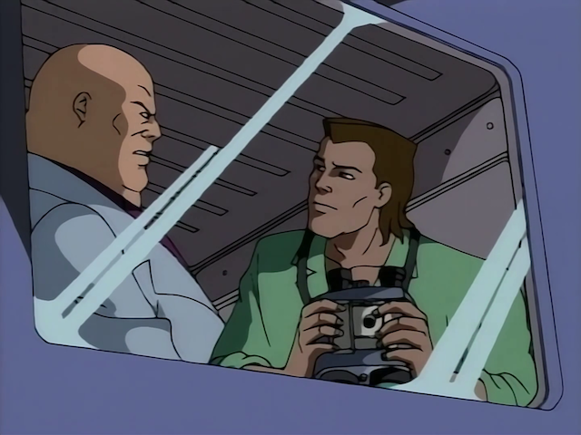

.. class:: center

*"This town has a new Kingpin, Osborn. And it's me!" - Hobgoblin*

**Written by**: Stan Berkowitz.

The enemy of my enemy is my friend is the logic of here. The Hobgoblin takes over Kingpin's criminal enterprise and pays the price soon after. Following the uneasy alliances of the last episode, everything is shuffled here: now Osborn and Kingpin have to take out the Hobgoblin. They use Spider-Man to do their bidding and the irony of the webhead helping them without knowing that Kingpin is pulling his strings is an awesome achievement of the script.

While nothing is as good as **The Alien Costume** arc, the Hobgoblin's arc has its strong moments, specially the creative fight scene where Spider-Man doesn't have buildings to swing his web to run away from the villain's attacks, having to use his feet and quick thinking.

**Day of the Chameleon**
************************

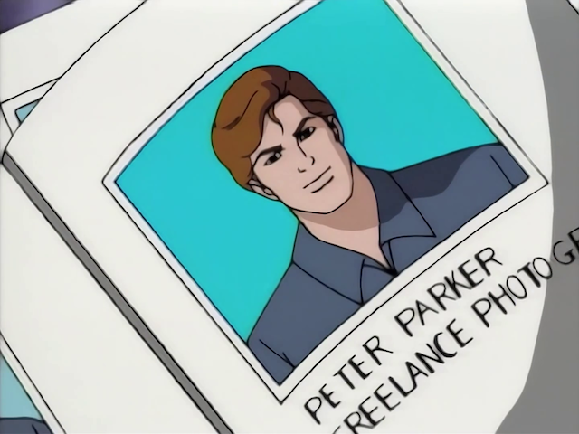

.. class:: center

*I took a gamble that Peter Parker was the luckiest man on Earth. - Chameleon*

**Written by**: John Semper.

The season finale brings Chameleon, an international spy, to ruin a peace proposal. SHIELD enlists J. Jonah Jameson to catch him and avoid the murder of two diplomats while Spider-Man sticks his nose in the middle of everything because that's what he does.

Chameleon is a good villain because while he is not presented as a mortal threat to our hero, his gimmick is at least the source of funny material. The rule of this episode is to finish the season in a high note and even when Peter gets caught in a bad situation - Chameleon kisses Mary Jane while disguising as him - the purpose is only comedy. The script is smart and doesn't do a banana peel ending to the story since Chameleon actually gets caught because of two mistakes that he could not avoid.

A smart bad guy, an intelligent good guy, Nick Fury congratulating him and Peter in hot water with Mary Jane... that's quite a good day for our friendly neighborhood Spider-Man.

And that's it.

This is a light-hearted first season compared to the more serious tone of the rest of the series. **Spider-Man: TAS** barely missed a step and delivered the goods, specially with the Venom arc. The rogues' gallery was well introduced and the Hobgoblin, Dr. Octopus and Scorpion had great appearances. Kraven and the Spider Slayers were lowlights of the season, but the overall experience was a great reimagination of this brilliant universe.

.. _`Blue Album`: https://en.wikipedia.org/wiki/Weezer_(Blue_Album)
.. _here: https://www.youtube.com/watch?v=sRfu94lOEPo