Spider-Man: The Animated Series (Season 02)
###########################################

:date: 2023-01-22 14:04
:modified: 2023-01-22 14:04
:tags: tv, spider-man
:category: tv
:slug: spider-man-season-two
:authors: Andre Fellipe da Silva
:summary: I'm back. Now with Spotify instead of Youtube. This post was written to the sound of Pearl Jam's `Vs.`_. You can listen one of the songs here_.

I decided to write here again after two years without doing it. Writing is one of my favorite hobbies and writing about pop culture and random topics was something that I missed. Since my **Spider-Man: The Animated Series (TAS)** `first review`_ only covered the first season of the show, I'll be reviewing the rest in the following months.

Season two, here we go.

Bob Richardson directed all episodes.

**The Insidious Six**
*********************

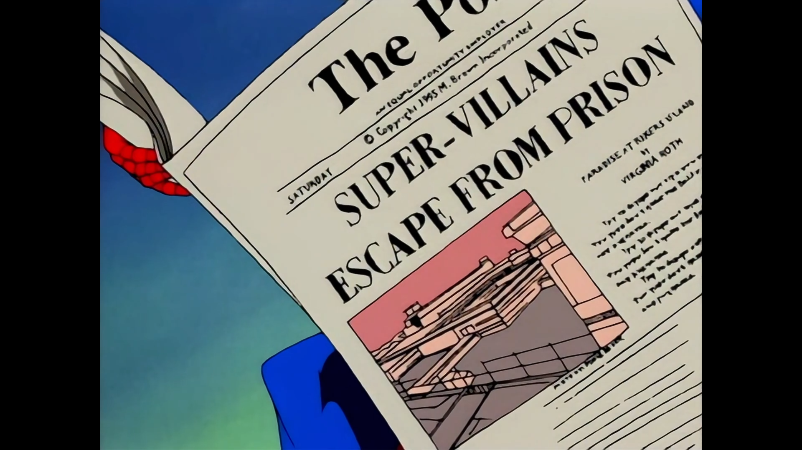

.. class:: center

*"I go to sleep one lousy day and I wake up in The Twilight Zone." - Spider-Man*

**Written by:** John Semper and David Lee Miller.

The second season of **Spider-Man: TAS** starts with one of the most famous Spider-Man stories: The Insidious Six. In this version, Kingpin frees Rhino, Shocker, Doctor Octopus, Mysterio, Scorpion, and Chameleon to take down our hero. Meanwhile, Spider-Man starts to lose its powers in the most unfortunate times. The episode does a good job on playing up the tension between the villains, with Doctor Octopus being reluctant to join forces with them because its own scientific adventures and the conflicts between themselves to see who gets to eliminate Spider-Man. The combination of both storylines - the supergroup villains and Spider-Man without superpowers - creates a positive dynamic, with the hero having to scape on foot and changing it to Peter Parker to avoid disaster. The usage of Aunt May to attract Peter to a trap without its powers leaves us with a tense cliffhanger for the second part. This is a strong start to the season even though it leaves use with a feeling of not much new things happening since Spider-Man is facing previous enemies that we already saw last season.

New characters such as Michael Morbius and Silvermane are introduced in small bits. Considering how well the series plays with storytelling, I am certain that this is not the last time we will see them this season.

**Battle of the Insidious Six**
*******************************

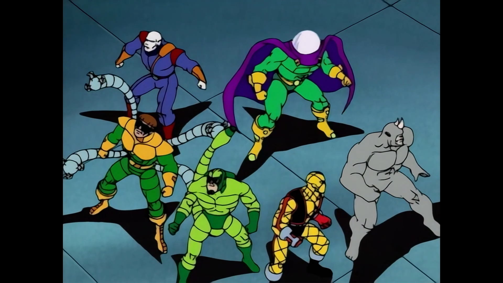

.. class:: center

*"I'll hit them first." - Kingpin*

**Story by**: John Semper.

**Teleplay by**: Doug Booth.

The second part of the Insidious Six storylines delivers after the good setup in the first part. The most interesting dynamic here is having Spider-Man save Silvermane without knowing anything about the villain and the crossfire between the crime lords while fighting Kingpin's faction. Silvermane is no match for Kingpin when it comes to being a worthy foe for Spider-Man, but the character here serves its purpose, even though why Kingpin should be intimidated by him is not clear. The narrative plays into the "Spider-Man without powers is easy pickins" heavily. The best bits of the episode comes when Spider-Man does not have superpowers and has to rely on Peter's intelligence - and the villains' lack of it - to survive multiple onslaughts. Spider-Man outsmarting six of its main foes at the same time is too good of a premise for anyone to mess it up and the writers deliver once more in this solid start to the season. It's Spider-Man at his best and a delight for us to see.

**Hydro-Man**
*************

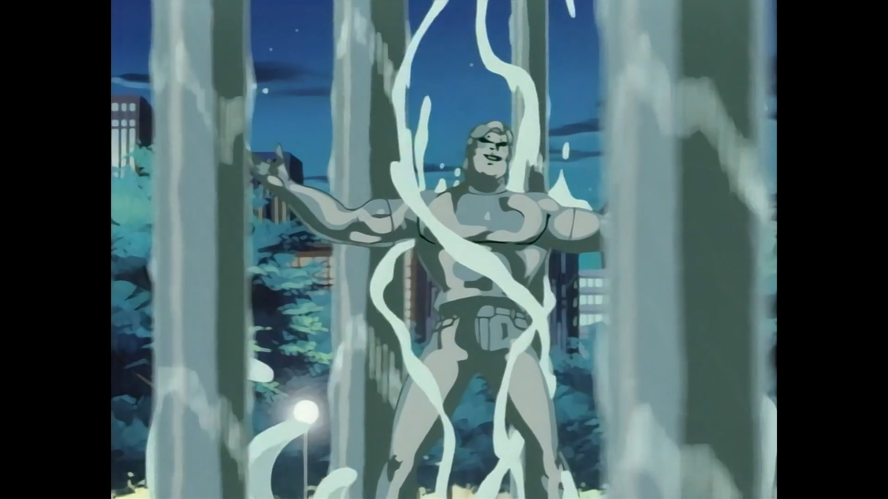

.. class:: center

*"I can give you everything you've ever dreamed of." - Hydro-Man*

**Story by**: John Semper.

**Teleplay by**: James Krieg.

This is the first episode where Spider-Man is only here for the action since the writers decided to give the spotlight for Mary Jane. While our hero is preoccupied with its mutation, Mary Jane receives a unexpected visit from her ex-boyfriend, Morris "Morrie" Bench, who now has superpowers and commits a series of robberies to have money and win her back. The main purpose of the episode is to give more backstory to the Mary Jane character, specially considering that we only know her through the eyes of Peter Parker. While her ex-boyfriend and father storyline is abrupt, I believe that it is because the show until now did not present any story with a similar tone as this one. **Spider-Man: TAS** focus on Peter Parker, its dramas and its villains with the rest playing it a low-key role in everything. This is the first time the show dedicates so much time to another character and this decision pays off for the future of the series, even though Hydro-Man is too stereotypical here as the bully former boyfriend to be that interesting as a foe. Spider-Man was not even needed to beat him. While not perfect, this was a valid effort to change the scenery for once, with Peter and Mary Jane finally kissing for the first time at the end.

**The Mutant Agenda**
*********************

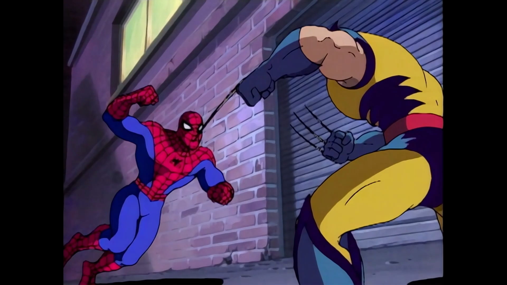

.. class:: center

*"But I don't want to be a freak." - Spider-Man*

**Story by**: John Semper, J. M. DeMatteis and Stevent Grant.

**Teleplay by**: Michael Edens.

Now the season raises the stakes. **The Mutant Agenda** brings the X-Men and allows the show to take its most bold universe expansion so far, crossing over the mutants with a conflicted Spider-Man. While the previous episodes gave glimpses on our hero psyche dealing with its continuous mutation, the fourth episode of the season dives deep on this, with Spider-Man rebuffing the X-Men and isolating himself in searching for a cure. Its Spider-Man at its most serious ever since the Venom storyline and the writers always know how to hit the right points to increase the paranoia, showing the hero's fear of becoming something not human. The X-Men universe blends well with all of this, with the introduction of Herbert Landon, its devious plan and the return of the Hobgoblin sounding natural. The episode introduces and brings back elements of the show with ease, resulting in a crossover fight between Spider-Man and Wolverine that was brewing since the first minute. An excellent episode that pushes the season in a darker direction.

**Mutants' Revenge**
********************

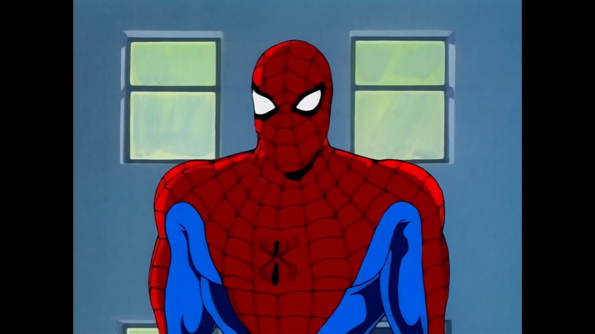

.. class:: center

*"I had to be reminded that when I'm in trouble I'm not alone. I need to turn to my friends." - Spider-Man*

**Story by**: John Semper and Michael Edens.

**Teleplay by**: Francis Moss and Ted Pedersen.

Spider-Man is a lonely hero. While he has partners that can help him when a dangerous situation arise, he must hide its identity to protect the people close to him. His financial situation is not the best. He has to deal the death of Uncle Ben in his mind. He is not a part of a superhero team. Peter Parker carries the weight of the world in his shoulders and that's why we love him so much. **Mutants' Revenge** reminds our hero that he can get help from his friends when the going gets tough. In the episode, Spider-Man has to make amends with the X-Men to beat Herbert Landon and the Hobgoblin and finds a possible path to cure its mutation. The way the episode starts with a fight with Wolverine and ends with a green monster while also putting the Hobgoblin in the mix is quite fun and guarantees the action throughout the twenty minutes. Also, the banter with Wolverine goes as well as one can expect. Our heros band together to beat the villain, New York survives once again. Even with this, the final moment is the show in one of its most poignant moments so far: why Spider-Man took so long to go for a friend's help? Why does he have to deal with all that is going on his mind alone? Maybe he has not. That's what this episode is all about. Let's see if it worked in the next one.

**Morbius**
***********

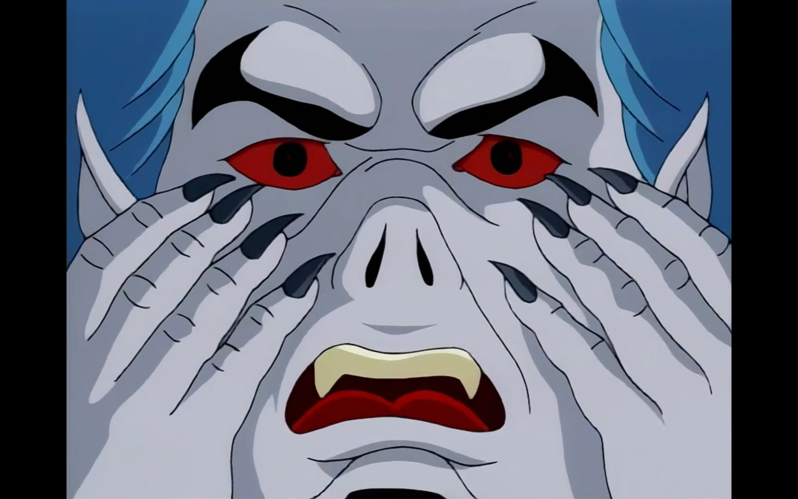

.. class:: center

*"I need more plasma." - Michael Morbius*

**Story by**: John Semper.

**Teleplay by**: Brynne Stephens and Lydia Marano.

Well, it did not. **Morbius** becomes a vampire-like creature after messing with Spider-Man's blood and the neogenic recombinator. This leaves Spider-Man wondering why everything related to him is poison to his closest people, triggering him to drink the serum that Dr. Crawford made. Then the mutation on his body accelerates instead of curing him. Voilá, we have Peter Parker with four extra arms and my childhood was ruined as soon as I finished this episode. This is a another great installment of the season, transforming Michael Morbius from creepy guy to a tragic figure in love with Felicia Hardy. The amount of tragedies in the second year of the show keeps increasing and it's interesting how the writers can introduce a character like Morbius in a subtle way and a couple of episodes later transform him in one of the series most compelling characters. It's interesting how the good the fight scenes here are, the first with a couple of common robbers almost taking Spider-Man out in a funny bit and the one with Morbius showing our hero not even fighting him, but trying to save him. Considering where we were in the sixth episode of the light-hearted first season, we can see here how much the show has already matured.

**Enter the Punisher**
**********************

.. image:: images/13-07-S02E07-punisher.png
  :alt: Shot from the seventh episode of the second season of the Spider-Man 1994 television series.
  :align: center

.. class:: center

*"Let's just say that you don't own the franchise on weirdness." - Spider-Man*

**Written by**: John Semper and Carl Potts.

The hunt is on. Punisher shows up to get Spider-Man thinking the six-arms wall crawler kidnapped Morbius. The introduction of the character does seem out of the blue at the start, but enough context is given for us to move forward. This is the episode where Spider-Man mutates into Man-Spider during its fight with Punisher as the cliffhanger. Meanwhile, Morbius is still hungry for plasma. Mary Jane is angry at Peter for not accepting a date with her. A lot of moving parts here. The episode has a great ending, but, overall, it is uneven because the Punisher sounds too much like generical tough guy here. The way the character is presented and its motivation to take out Spider-Man are not convincing, even though the action is good. The episode hits the necessary notes to advance the story and Spider-Man with six arms and as Man-Spider are nice visuals, but after the previous episodes, this was a downgrade.

**Duel of the Hunters**
***********************

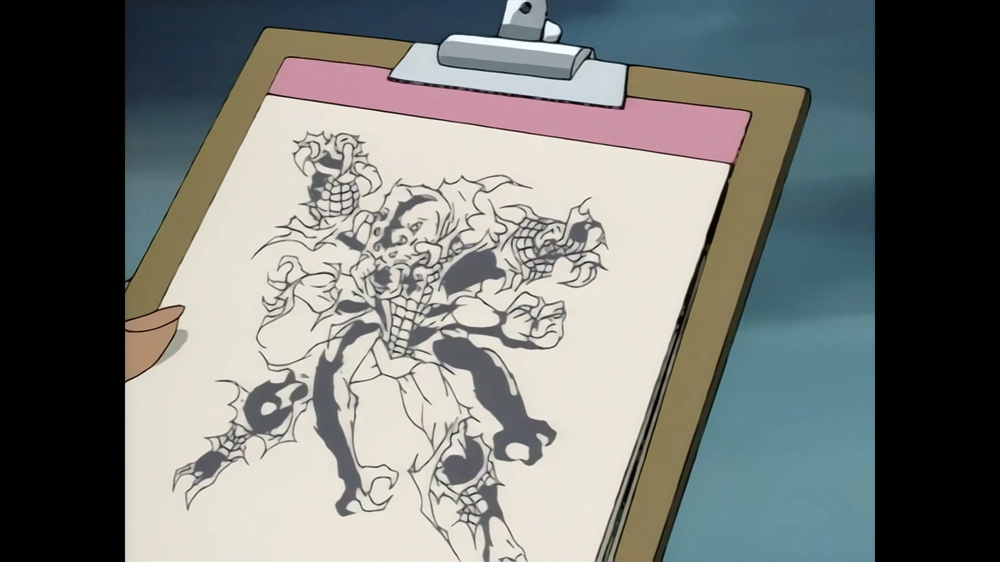

.. class:: center

*"I looked at the devil square in the eyes... And I blinked." - The Punisher*

**Written by**: John Semper.

The Man-Spider storyline reaches a conclusion in explosive fashion, with all the different players involved - Man-Spider, Morbius, Kraven, and Punisher - battling it out in some shape or form during the twenty minutes. It's interesting how the writers combine two characters that were not interesting at first - Punisher and Kraven - and create a positive dynamic with them. This happens because this episode focus on the human side of them instead of the stereotypical characterization that both of them had in previous installments of the series. This is the episode where Spider-Man has almost no dialogue because the of the Man-Spider mutation, so other characters have a better chance to shine. It's one of the best episodes of the season with a powerful message. Monsters sometimes are true victims and we should not give up on people because of our previous experiences.

**Blade, the Vampire Hunter**
*****************************

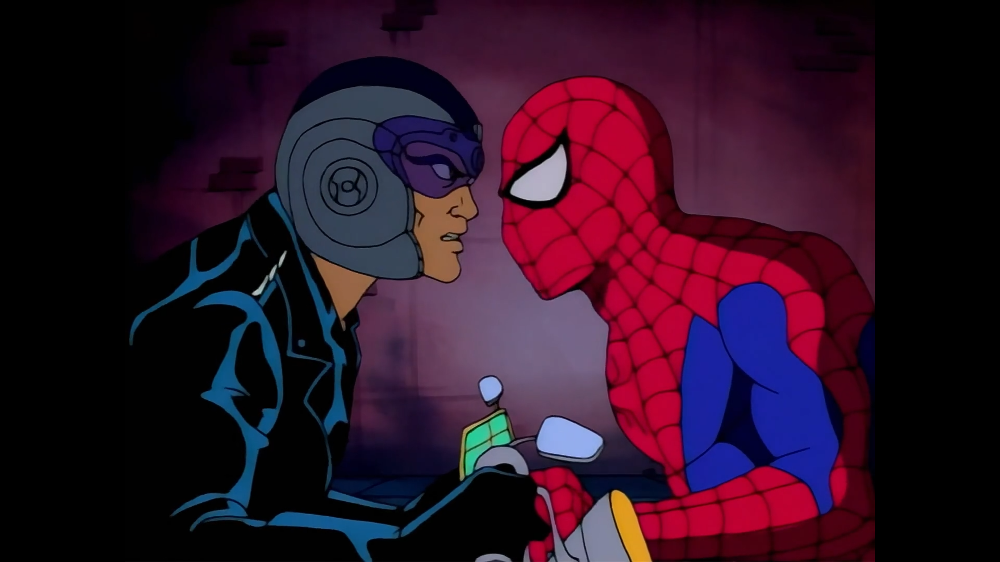

.. class:: center

*"Is there a vampire convention in town?" - Spider-Man*

**Written by**: Stephanie Mathison, Mark Hoffmeier and John Semper.

Another new player shows up in New York: Blade. And he wants Morbius dead. It's interesting how the show introduces Blade in a much better way than the Punisher, giving the character a proper backstory in his first appearance and explaining his hatred for vampires. This propels a interesting episode where he wants to kill Morbius while Spider-Man wants to save him. In the meantime, Morbius learns how to love its powers and wants to transform everyone in vampires, a rehash of the Lizard story that we saw in the first episode of the series. The fight scenes and the mythology involving vampires expands even more of the already rich universe of the show. What makes this episode good, though, is one of Spider-Man recurrent themes: how he still tries to save the world around him while everyone dislikes his guts, as seen here with the police and the people of New York thinking he is the villain. This is always a good plot device and it plays well here. Another important point is how much of the season is composed of Spider-Man teaming with other people to achieve something, as seen here with Blade. Another hunt is on. This time for Morbius.

**The Immortal Vampire**
************************

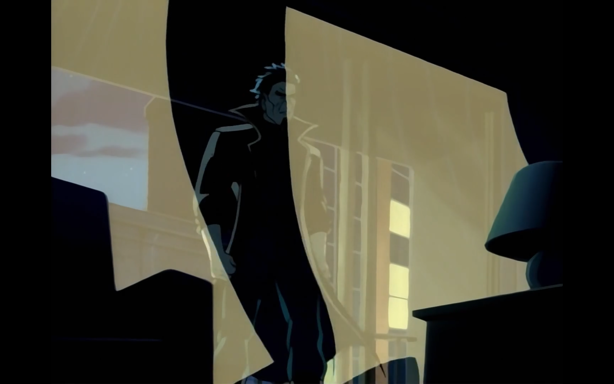

.. class:: center

*"What is running in your veins? Ice water?" - Terri Lee*

**Written by**: John Semper and Meg McLaughlin.

The Morbius storyline reaches its conclusion without much conclusion. He kidnaps Aunt May to use as leverage to get Peter to collaborate with him. This triggers an angry Spider-Man that has to rescue her while trying to save Morbius. Meanwhile, Blade and Detective Terri Lee fall in love. This is an episode where a lot of things happen, but they do not have a clear-cut sense of finality, a novel concept for the show. Morbius mutates further into a bat and flies away, Blade goes as well and Peter is relieved since Aunt May is not hurt. Also, Mary Jane finally has enough of him and chooses Harry Osborn. My biggest disappointment with this episode is that it appears to leverage the `If This Be My Destiny...!`_ moment from the comics when it puts Aunt May in danger, but does it so in a half-assed manner, with the classic panel where Spider-Man uses its willpower to scape from danger being used in a Morbius confrontation with almost no dramatic effect. Considering that it is one of the comics most idolized arcs, being used here in such an unconvincing way is what keeps this episode from being great, even though the conflict between Blade, Spider-Man and Morbius creates great action scenes, with Peter desperate to keep the vampire away from his loved ones. Putting Peter's friends and family in the heat of Spider-Man's battles is one of Spider-Man best storytelling devices and **The Immortal Vampire** uses it for a good effect.

**Tablet of Time**
******************

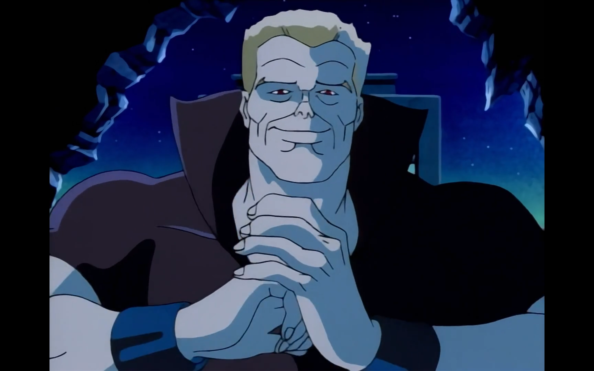

.. class:: center

*"Speak for yourself, bugboy. I don't breathe." - Tombstone*

**Written by**: Mark Hoffmeier, Stan Berkowitz and John Semper.

The one where everybody is kidnapped. The crime lords showdown is back on the spotlight in **Tablet of Time**. Kingpin and Silvermane are after an ancient artifact known as the Tablet of Time, which has the special power of restore the youth. Dr. Connors and Spider-Man are caught in the middle of this and we have new super robots and new villains - Tombstone and Alisa Silver - to deal with. This episode does a lot of preparation for the final episodes of the season, which the Tablet of Time heavily influences, so the most important parts here are the small character studies that we get a glimpse of. Kingpin has troubles in his marriage since his wife is no longer interested in his line of work. Peter tries to get over Mary Jane and Harry Osborn together and falls right into Alisa Silver's trap. Dr. Connor has to hide away the Lizard once again. While not a groundbreaking or memorable effort, the episode does an appropriate job to setup what comes next on the show.

**Ravages of Time**
*******************

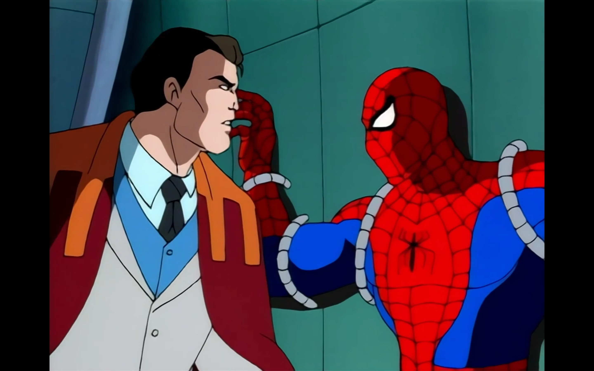

.. class:: center

*"I want to see who is behind the mask." - Silvermane*

**Written by**: Mark Hoffmeier, Stan Berkowitz and John Semper.

Now that's a monkey's paw. Silvermane reaches its goal for youth, but too much of it came through. The best part of **Ravages of Time** is seeing Silvermane as a baby after all of the hoops to get the Tablet of Time and how Kingpin disposes of it as soon as it acquires for being a reminder of his marriage's problems. The overall sense of waste of time from both villains after the endeavor has a weird humor to it. There were chases, hostage exchanges, scientific experiments and a lot of fighting and nothing was accomplished. Well, at least not for the bad guys, but surprisingly we finished an episode where Spider-Man ends in a place better than where he was at the start, with Dr. Connors being better after receiving the rays from the Tablet of Time. Our hero, though, is still without a cure for its mutation, but at least seeing his friend not suffering is a bright spot in the gloomy atmosphere of the season. This is the weakest storyline of the season - Hydron-Man was a self-contained episode - but we are still advancing towards a finale where Spider-Man still has its unresolved mutation to solve it. While it seems like we are running out of gas in the story and the writers are covering this with crossovers and new characters for the sake of it, the show has earned enough credit for us to have better hope for the final two episodes.

**Shriek of the Vulture**
*************************

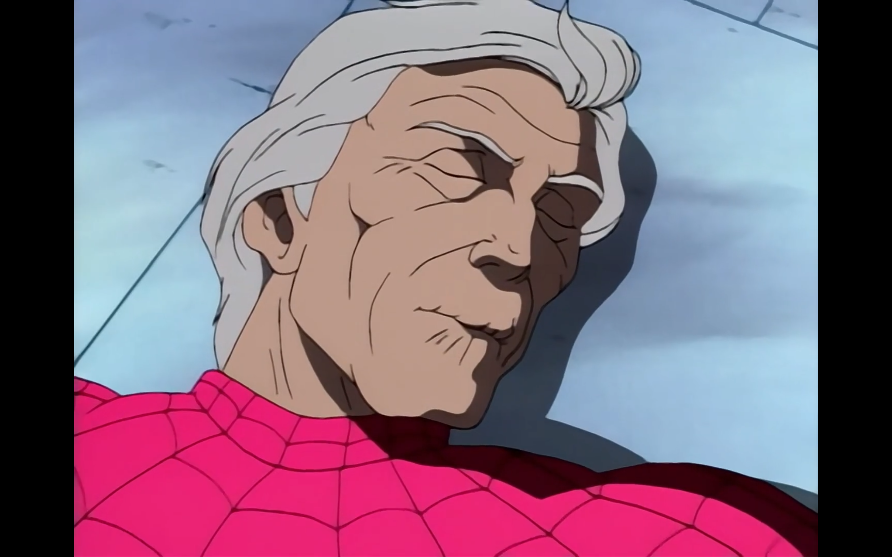

.. class:: center

*"She definitely likes you, pal, so she can't be that smart." - Peter Parker*

**Written by**: John Semper, Gilles Wheeler and Eyelyn A. R. Gabai.

For the surprise of all, Flash Thompson saves Spider-Man from the Vulture. This episode is an interesting introduction to a member of the rogues gallery that was not yet introduced. The Vulture shares in part the motivations of Silvermane in the previous episodes: have more youth and take out Norman Osborn for the attempted takeover of his company. While the fights and the cliffhanger are fun, the most interesting aspect of the episode is Flash officially going from a bully to a all-american-kind-of-a-buffoon type of hero. His pairing with Debra Whitman works well and the romance between them plays out in natural fashion for a couple of characters that we are not that close in the show. The season goes for its season finale with less tension and darkness than its middle part. Considering that we saw Man-Spider this season, Peter Parker getting old from the hands of the Vulture lacks the drama of the previous storyline. This final stretch of the show's second year is not bad by any means, it just suffers from having to follow-up a strong beginning and middle part of the season.

**The Final Nightmare**
***********************

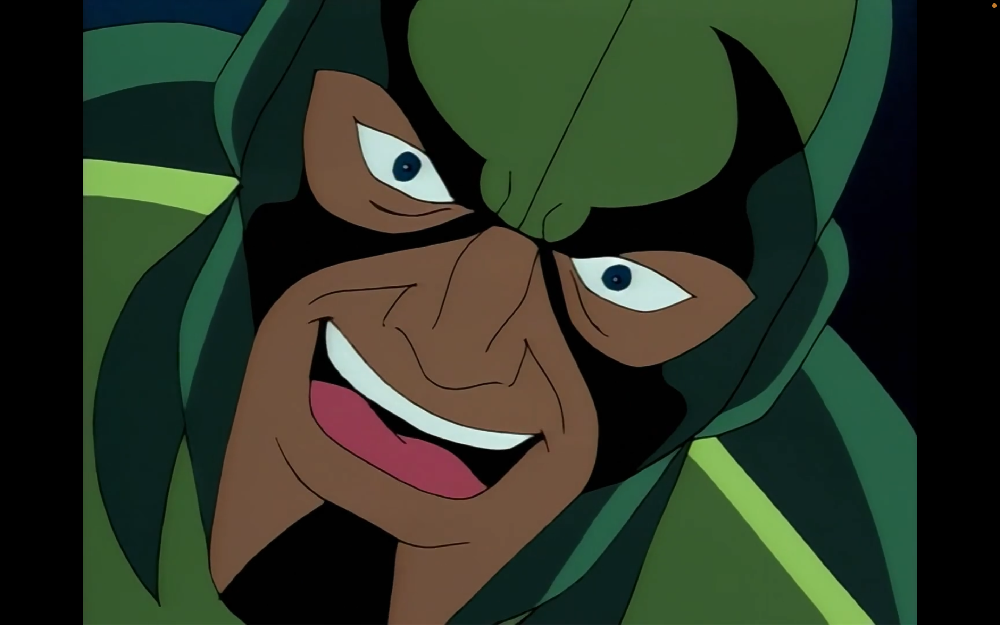

.. class:: center

*"I guess we old folks have to stick together." - Spider-Man*

.. class:: center

*"I had no idea you were a senior citizen." - Old Lady*

.. class:: center

*"It's the job. It ages you." - Spider-Man*

**Written by**: John Semper and Sandy Fries.

The neogenic nightmare is over. The second season ends in a high note with the Vulture absorbing Spider-Man's mutation and our hero finally being cured after Dr. Connors saves him. But, unfortunately, nothing really good happens with Peter Parker without bad news following it up. Mary Jane mysteriously disappears and this is how the second season ends. Peter can't catch a break. From this last bunch of episodes, this is the best one. Ironically, it's another instance of where the writers combine different villains and characters in a confrontation - Scorpion, Vulture, Lizard and Spider-Man - for multiple reasons, but this one feels more natural thanks to each character having a motivation to use the neogenic recombinator. The irony of the Vulture having the Man-Spider mutation is an interesting twist and another fun monkey's paw moment from the show, but the adventures of an old Peter Parker is my favorite part of the season finale, specially when he has to confront a couple of burglars in an alley. It's a fun episode with a cliffhanger ending that already causes interest for the third season.

That's it. It's been a pleasure to cover the second season of **Spider-Man: TAS**. The season is darker, works in a much more serious tone and shows a series more comfortable with its storytelling style. The first half is one of the show's best runs and while the final episodes do not have the same excitement, they are solid enough to make this a great season.

Now, let's go on to season three.

*"Thank you for giving me back my life. What a beautiful day this is gonna be! I feel lucky to be alive. And lucky of being who I am: Spider-Man." - Spider-Man*

.. _`Vs.`: https://en.wikipedia.org/wiki/Vs._(Pearl_Jam_album)
.. _here: https://open.spotify.com/track/5XtyytAig4m3HkO2XXaL9l?si=945458a504904b62
.. _`first review`: https://andrefellipe.com/spider-man-season-one.html
.. _`If This Be My Destiny...!`: https://en.wikipedia.org/wiki/If_This_Be_My_Destiny...!
