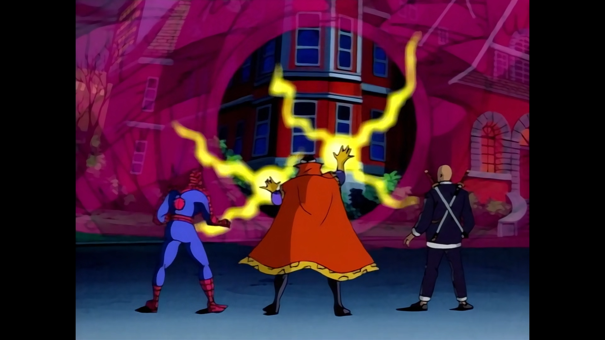
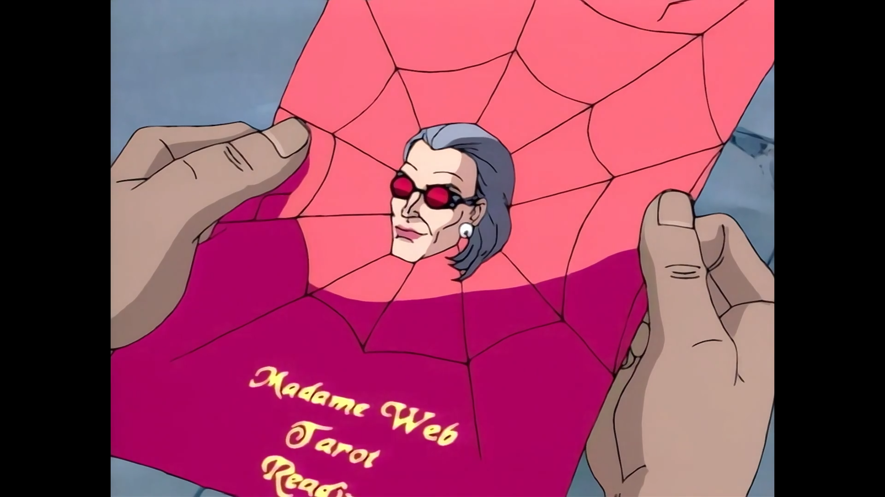
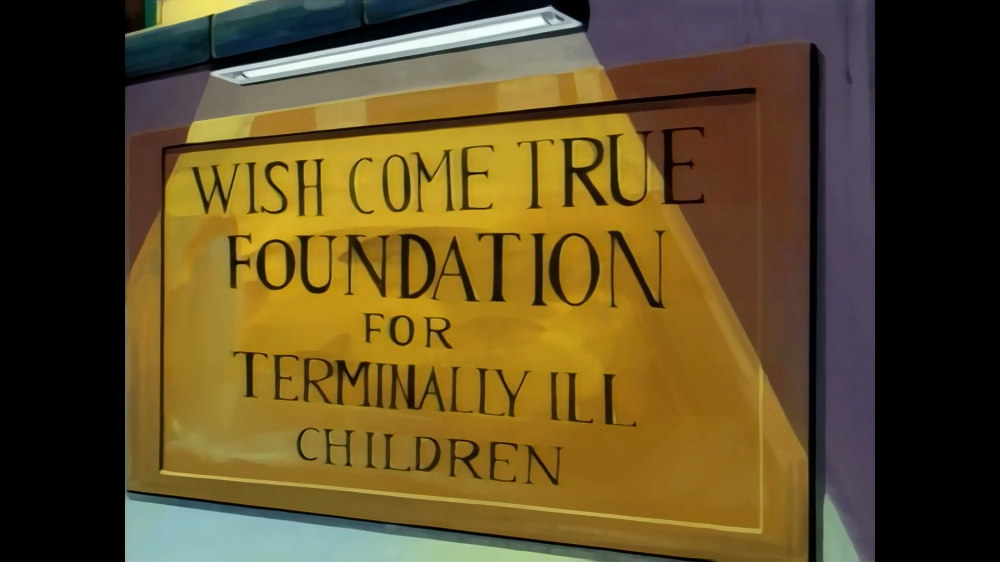
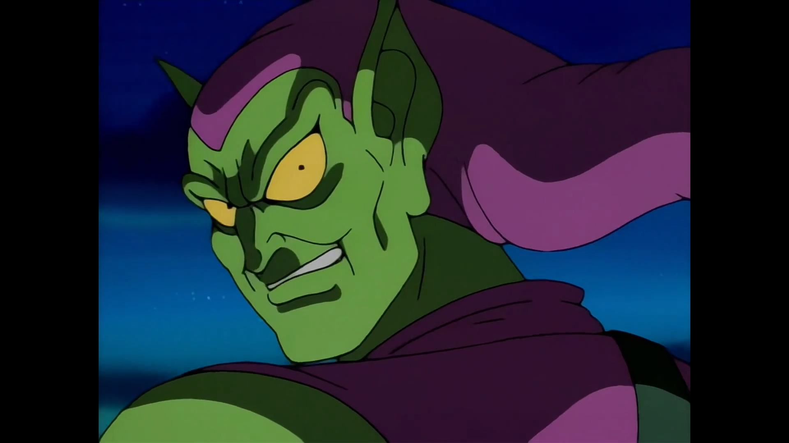
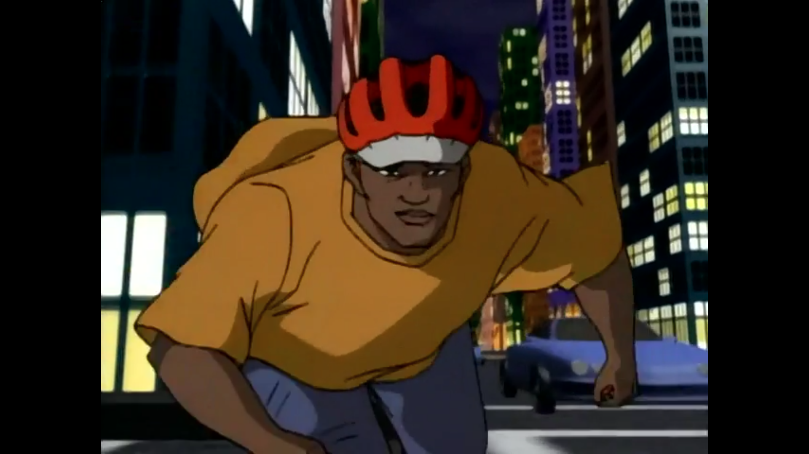
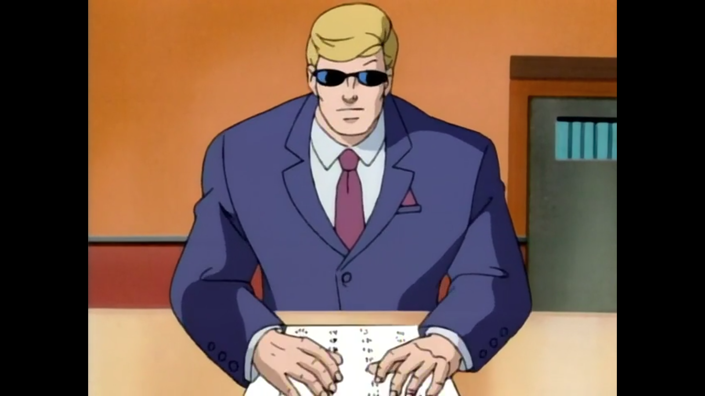
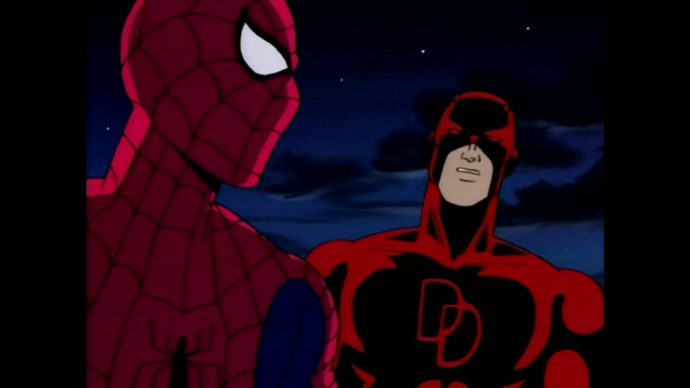
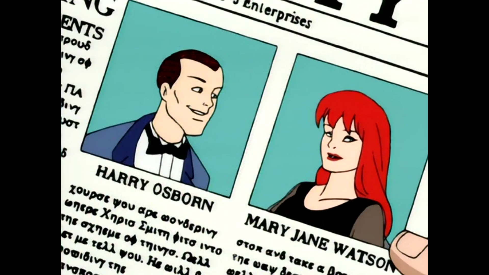

Spider-Man: The Animated Series (Season 03)
###########################################

:date: 2025-03-16 22:18
:modified: 2023-03-22 22:29
:tags: tv, spider-man
:category: tv
:slug: spider-man-season-three
:authors: Andre Fellipe da Silva
:summary: I'm back again. And I ditched Spotify. This post was written to the sound of Rita Lee's `Fruto Proibido`_. You can listen one of the songs here_.

Season three, here we go.

Bob Richardson directed all episodes.

**Doctor Strange**
******************

.. class:: center

*"You should take that act to Vegas. All he needs is a couple of tigers." - Spider-Man*

**Written by:** John Semper and Mark Hoffmeier.

Family is a fundamental aspect of any iteration of the Spider-Man story and the season premiere of the third season brings this to the forefront. Mary Jane is kidnapped and Spider-Man is looking for her. After a season of sci-fi horror, we encounter the magic world of Doctor Strange, Wong, Baron Mordo, and Dormammu. This was a great change of pace for the series, an episode where Spider-Man's powers were pretty uneffective in combat. Mary Jane that assumes the protagonism here, dealing with her abusive father's past and being brainwashed because of that. It was a great character arc for Mary Jane to overcome by herself the mind control and break free of her past. This allowed her to be a protagonist and not just a damsel in distress. The episode also introduces Doctor Strange in great fashion, telling us about its story with Mordo through quick and productive flashbacks. The character added a lot to the episode, with Spider-Man's reactions to the world of magic being the humorous highlight here.

**Make a Wish**
***************

.. class:: center

*"I am not your enemy, Peter Parker. You are." - Madame Web*

**Story by**: John Semper.

**Teleplay by**: Mark Hoffmeier, Elliot S. Maggin, and Meg McLaughlin.

*Make a Wish* is a brilliant episode. It combines three of the best stories from Spider-Man into one and delivers the content in unforgettable fashion. We see Peter Parker giving up on being Spider-Man ("Spider-Man No More!"), Madame Web making her presence known and showing how important of a character it will be, the hero's origin story and a recollection of the classic `The Kid Who Collects Spider-Man`_. This combination shows a powerful story where we are reminded that Peter Parker has personal misfortunes amid his heroism. It just shows that his struggles will never be over as long as he embraces his responsibilities. The only negative here for me are the dream sequences in the origin story. I was never a fan of the dream sequences and Peter showing up as an actual spider is more gross than entertaining. But even with that, this episode still ranks highly on my list of favorite episodes of the series. The story, the chemistry with Taina, Madame Web confronting Peter, Doctor Octopus gaining the upperhand and outsmarting the hero... Everything positive meshes so well that brings the episode into a different bracket of great episodes.

**Attack of the Octobot**
*************************

.. class:: center

*"I do know who I am now. And I'll be ready. And it's all because of the faith of a little girl that's more of a superhero than I'll ever be." - Spider-Man*

**Written by**: Meg McLaughlin and John Semper.

Spider-Man loses his memory and begins an uneasy alliance with Dr. Octopus before Taina saves him. While a weird story, the emotional punches that shown in the relationship between Spider-Man and Taina makes this a sweet conclusion to the arc. The episode relies on Spider-Man being confused about his identity, both because of amnesia as well as because of his previous disappointments, which led the protagonist to abandon his superhero persona. This is a deep arc that resonates with Madame Web's talks about a bigger challenge coming for our hero and those moments are the heart of the episode. My least favorite aspect are the robberies with Dr. Octopus, but it is understandable why they are needed. Our glimpses on the cab drivers community helping our hero are a delight, though, showing how much of an impact Peter Parker has on the city. This episode is a nice collection of sweet moments, ending with a darker tone that only amplifies the meaning of all that we just witnessed.

**Enter the Green Goblin**
**************************

.. class:: center

*"Alright, Hobgo... You are not the Hobgoblin!" - Spider-Man*

**Story by**: John Semper.

**Teleplay by**: Marty Isenberg and Robert N. Skir.

The third season of **Spider-Man: TAS** has every episode with the prefix The Sins of the Fathers. In the Season Premiere, it was Mary Jane that had to deal with the trauma that her father caused in her life. Here, we take a closer look at Harry, which brings us the debut of the Green Goblin. It is an interesting choice to have one of the main antagonists debut almost as an one-off, but this takes nothing from the episode. The Green Goblin establishes himself as a menace out of the gate kidnapping Oscorp's Board of Directors and Mary Jane. The insanity of the character is well displayed and the action sequences with Spider-Man are well crafted. It is interesting that everything is presented as the result of an accident and Norman Osborn returns to normal at the end of the episode. The Green Goblin has much more importance in future episodes and his introduction is just a small bit of much more evil things that will come from the character.

**Rocket Racer**
****************

.. class:: center

*"Yes, ladies and gentlemen, it's Robert "The Rocket" Farrell slashin' up the sidewalk! Will the curb be a problem? No way! He too stoped to be stopped! Radical aerial! The crowd goes wild! He swings the stairs like a pro! And then for the grand finale..." - Robert Farrell*

**Story by**: John Semper.

**Teleplay by**: Doug Booth and Mark Hoffmeier.

You are not your thoughts. Whenever a thought comes to your head, good or bad, you have the power to act or not upon it. Robert Farrell struggles with bad thoughts throughout this episode. If his past already condemns him as a criminal, why should he try to be a better person? Farrell almost gives in to the dark side on multiple occasions, but decides against it at the last minute. His caring love for his mother makes him to strive towards being a better person, even with hiccups. Seeing him learn that while fighting against what seems like the whole world is what makes this episode a surprise this season. Even though it puts Spider-Man and Peter as afterthoughts, Farrell more than carries his share of the bargain. The villainous Big Wheel is far from an interesting rival, but it serves its purpose here. The moral dilemma is what carries this episode. A boy - without a father, important to note - finally deciding who he is and choosing his abilities to do good. This is generally considered the worst episode of the series by the fans, but I will not go that far. It could be a worse execution.

**Framed**
**********                                                                                                      

.. class:: center

*"They say justice is also blind. So I like to think it gives me a leg up on the competition. Judging from what you've gotten yourself into, we're going to need every bit of help we can get." - Matt Murdock*

**Story by**: John Semper and Mark Hoffmeier.

**Teleplay by**: Brooks Wachtel and Cynthia Harrison.

Daredevil arrives!

One of the best parts of the show is how Spider-Man interacts with other characters from the Marvel universe. We saw great episodes with X-Men and Blade, for instance, but Daredevil - at least for me - hits a special cord. My two favorite superheroes sharing the screen is a great recipe for a special episode. Here, Peter is accused of treason against the United States government and Matt Murdock is his lawyer since the Kingpin is involved in the scheme. This is one of the most fast-paced episodes of the show so far and packs a lot of information: besides the conspiracy plot, we also get Daredevil's origin story. It is incredible how Daredevil steals the show while he shares the spotlight with our protagonist, showing the strength of the character and its search for justice. The fact he does not know who Spider-Man is only makes things more interesting, since it puts them in a adversary position, creating great tension to end the first part of the two-parter.

**The Man Without Fear**
************************

.. class:: center

*"Sacrifices must be made." - Kingpin*

**Story by**: John Semper and Mark Hoffmeier.

**Teleplay by**: Sean Catherine Derek.

The one where Kingpin almost gets caught. One of the final moments of this episode with the fakeout where Spider-Man and Daredevil get the villain just so to be shown that was the Chameleon was incredibly well done. Well, all of **The Man Without Fear** follows this pattern, concluding one of the best arcs of the series and raising the stakes: Peter Parker now knows that Wilson Fisk is not who he seems to be. This changes the dynamic of the show moving forward and the final scene puts this directly in our faces. But even before these final moments, the episode showed great moments, with articulate fight scenes and another origin story. Knowing more about the tragic backstory of the Kingpin adds another layer to the character and the quote above shows how brutal he can be, leaving his son to go to jail without reply at the end. The way this episode open space for Daredevil and the Kingpin to shine shows how mature the show's writing can get, a characteristic that distinguishes the show from other similar cartoons.

**The Ultimate Slayer**
***********************

.. class:: center

*"But do you love him?" - Peter Parker*

**Story by**: John Semper.

**Teleplay by**: Doug Booth and Mark Hoffmeier.

Kingpin tries to strike back with the creation of the Ultimate Slayer. The series returns to the theme of the season: paternal relationships. Alistair finds that Kingpin has been manipulating him and that his father is alive, prompting the newly-created robot to turn on Wilson Fisk. This part of the episode is not bad, but hits like a downgrade as the follow-up to the Spider-Man/Daredevil adventure from the last two episodes. Alistair is just not there as a character to have that kind of spotlight. On the other hand, Mary Jane and Harry Osborn getting married and her second thoughts is a much more interesting storyline. She explaining her feelings to Spider-Man while it struggles to keep his feelings to himself is the best part of the episode. The chemistry between the characters brings life to the screen by itself, with this love triangle promising much more to the rest of the season.

.. _`Fruto Proibido`: https://en.wikipedia.org/wiki/Fruto_Proibido
.. _here: https://www.youtube.com/watch?v=JJhKbpjfXnQ
.. _`The Kid Who Collects Spider-Man`: https://en.wikipedia.org/wiki/The_Kid_Who_Collects_Spider-Man
