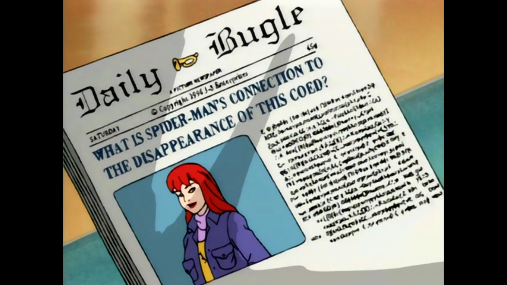
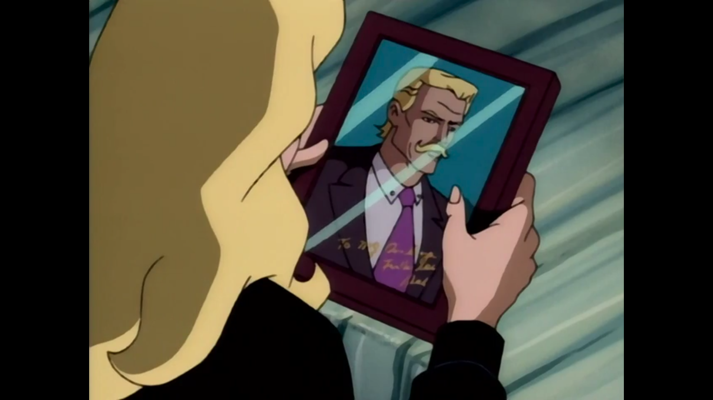
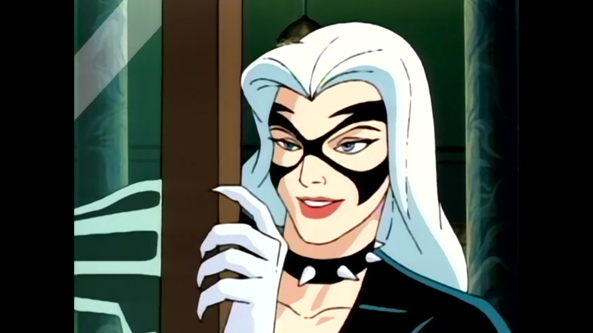
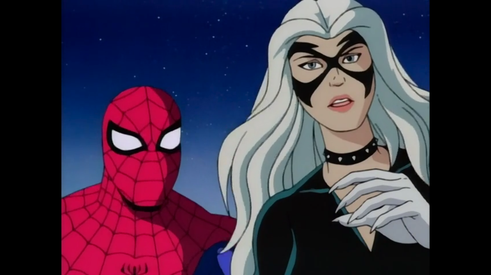
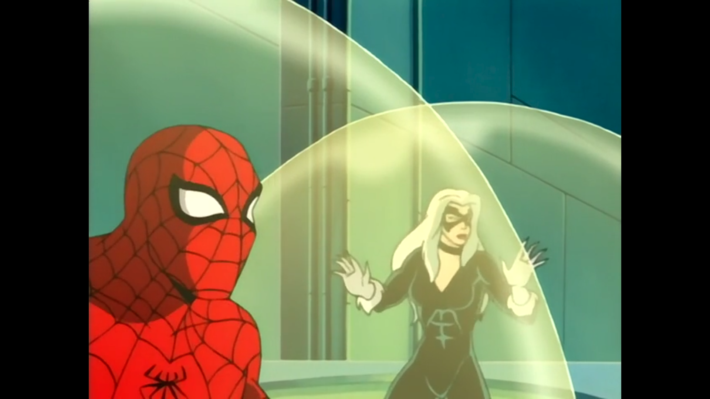
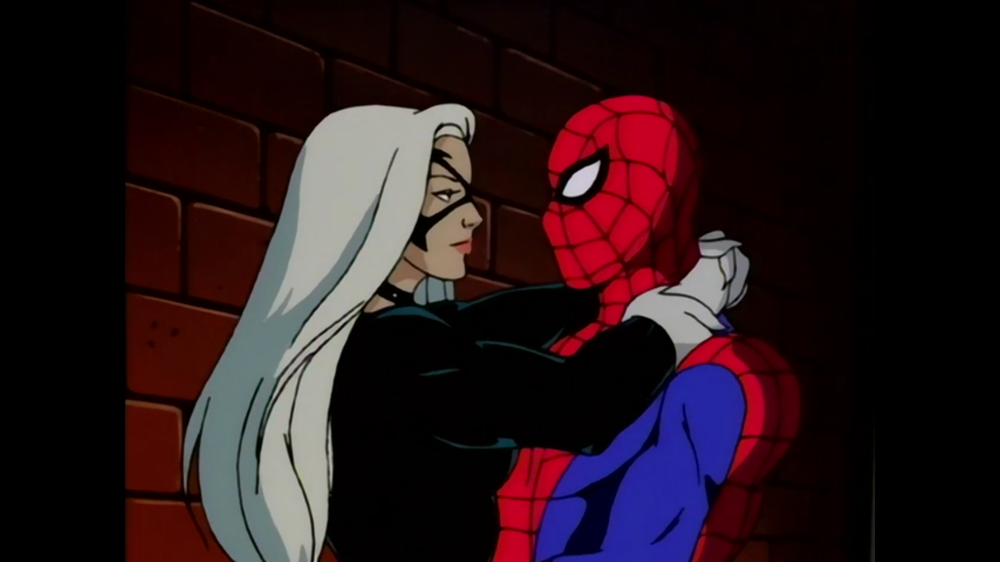
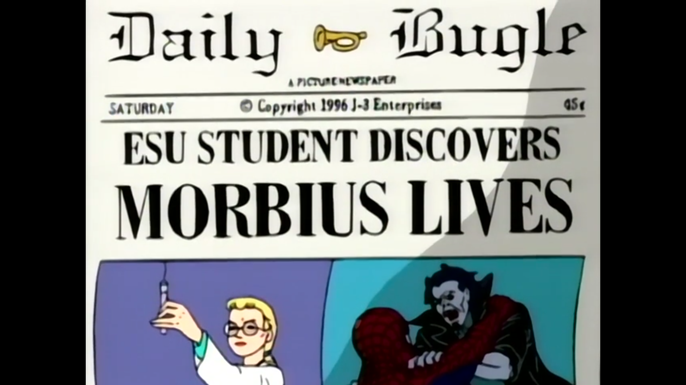
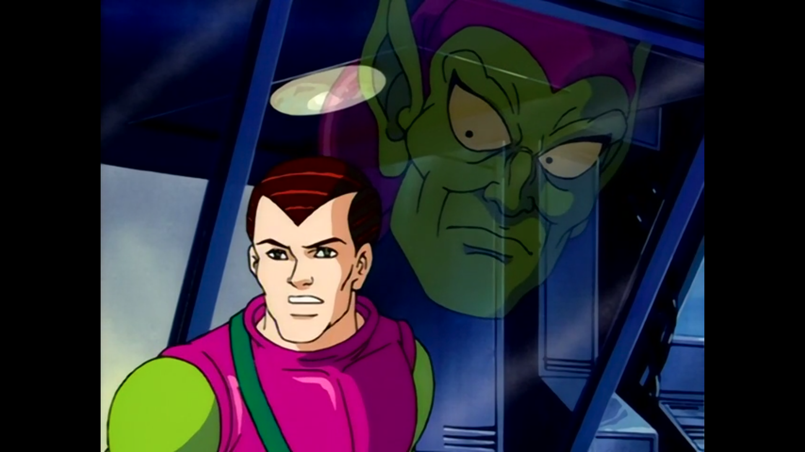
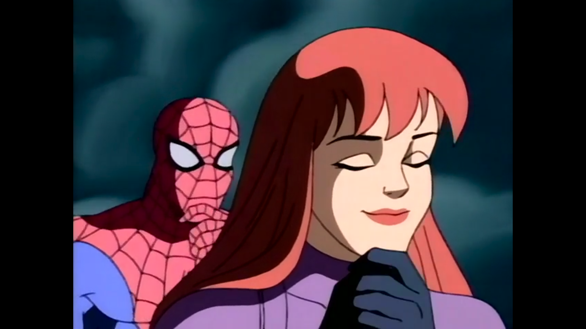

Spider-Man: The Animated Series (Season 04)
###########################################

:date: 2025-10-13 15:08
:modified: 2023-10-13 15:08
:tags: tv, spider-man
:category: tv
:slug: spider-man-season-four
:authors: Andre Fellipe da Silva
:summary: Once again, we're back. I'll finish these reviews of the show until the end of 2025. I promise. This post was written to the sound of Alt J's `An Awesome Wave`_. You can listen one of the songs here_.

After the best episode of the series, Season 4 of **Spider-Man: TAS** has high expectations. Can the show keep the momentum? Let's find out.

Bob Richardson directed all episodes.

**Guilty**
**********

.. class:: center

*"I hope you'll change your mind about taking pictures of Spider-Man, Peter. I've never been more convinced in my life that Spider-Man is a true hero. I know his job's not easy, but he's exactly what this city, this world, needs right now. I hope he never gives up." - Joseph Robertson*

**Story by**: John Semper.

**Teleplay by:** Larry Brody and Meg McLaughlin.

Guilt is a strong sentiment that drives Spider-Man for most of the premiere. Flashbacks from the previous Season Finale start us this season and what follows is a conflicted Spider-Man that thinks that his antics do more harm than good. We went in this place before in the series, but this time the stakes are higher since we are talking about the disappearance of Mary Jane. To surpass this, a small redemption story is a good starting point. Kingpin sets up Robbie and Spider-Man partners with "Jigsaw" Jameson to save him. The dynamic between the journalist and the hero here is great, generating some laughs along the way. While the episode is nice, it also feels like we already have this discussion about how Spider-Man does good to the world before in the series, so I believe that not much was added to the topic here. A solid start to the season to get us started.

**The Cat**
***********

.. class:: center

*"Why do I always fall for mysterious men? Jason, Michael, Spider-Man. Men who are wrapped in the dark blanket of the night." - Felicia Hardy*

**Story by**: John Semper.

**Teleplay by**: Sean Catherine Derek.

Felicia Hardy was always an interesting presence throughout the series, but it is about to receive a new spotlight as the Black Cat. This episode starts this, with her family once again in trouble. The way the writing combines a Kingpin plot with Captain America's origin and the Hardy family is really well done and a clever connection between stories. I am excited to have this new approach on the character and this kickoff of the plot shows how the show can take a side character and make a interesting storyline with deep connections to well-known comic book arcs. The lowlight here was Dr. Octopus just being a hired gun for the Kingpin, even though we know that the character can be much more.

**The Black Cat**
*****************

.. class:: center

*"Ever hear the phrase, divide and conquer?" - Black Cat*

**Story by**: John Semper.

**Teleplay by**: Marty Isenberg, Robert N. Skir, and Sean Catherine Derek.

The Black Cat is now officially with us. Kingpin develops the serum to create the Super Soldiers and applies it on Felicia Hardy. In this beginning, Spider-Man has great chemistry with her. The initial scene between them has great lines and tension that resonates through the rest of the episode. One of the best aspects of this relationship is that the Black Cat respected Spider-Man's identity and he does not know who she is, which makes the partnership more fun. Overall, Kingpin's plan to create super criminals is a little stupid and one of the instances where his idea makes little sense and is needed only to advance the plot. Even with a soft story, the moments between the main characters and the Hardy family more than make things up.

**The Return of Kraven**
************************

.. class:: center

*"There's nothing that beast can dish out that this beauty can't handle." - Black Cat*

**Written by**: Meg McLaughlin.

A good story needs a good villain. While the addition of the Black Cat is adding a lot to the show, Kraven returning does not do much for me. The best part of this episode is Spider-Man turning away the Black Cat for fear of hurting someone once again. Our hero turns to bitterness in multiple points of the episode while trying to understand why Kraven is back. The plot involving the Hunter is not that interesting, but the character moments from all characters here makes up for it. The ending is also an interesting part, with Peter moving in with Harry even after their issues throughout the last season. An enjoyable - even though forgettable - installment of the show.

**Partners**
************

.. class:: center

*"Maybe I should take superhero lessons from the Hulk instead." - Black Cat*

**Story by**: John Semper.

**Teleplay by**: Cynthia Harrison and Brooks Wachtel.

The fourth season of **Spider-Man: TAS** relies a lot on the dynamic between Spider-Man and the Black Cat, positioning her as a main recurrent character in a way we did not see before in the series. Even so, we arrive at the fifth episode of the season without a major storyline itself besides the relationship between them. This results in episodes such as **Partners**, where the stakes are not that high, but the show still keeps delivering enjoyable adventures. This time, the cast of the episode involves a lot of villains, but the highlight goes to the Scorpion, one of the best characters of the show. Here, he fights to cure himself from his disease to get married. He is unable to do so, but the way the writing puts him going from hero to villain to hero multiple times in the episode itself humanizes our green friend.

**The Awakening**
*****************

.. class:: center

*"I should be catching crooks. For once, I'm actually having fun." - Spider-Man*

**Story by**: John Semper.

**Teleplay by**: Sean Catherine Derek.

As expected since Felicia Hardy is a major plot point, Morbius returns in vampire form. At this point, the show feels like it is only hitting on its greatest hits from previous seasons because of a lack of creativity. Sometimes characters that have great sendoffs before can return to enjoyable success - such as Scorpion previously - but this time with Morbius is not the same. A lot of the writing is hitting on the same beat and even our interesting one-liners are not there. The only great aspect here is once again Spider-Man struggling to move on from Mary Jane and his interactions with the Black Cat. This is the point of the show's history where things seem most off and a return to form is needed.

**The Vampire Queen**
*********************

.. class:: center

*"What did I do wrong? Now Black Cat's left me, Felicia's gone, and Mary Jane's still missing. Well, at least there's nowhere to go from here but up." - Spider-Man*

**Story by**: John Semper.

**Teleplay by**: Meg McLaughlin and John Semper.

More people return, but no spark is seen. This is the theme of the season so far. **The Vampire Queen** is not a bad episode, but it is one where the only piece more interesting than anything by the numbers is the Black Cat leaving and Spider-Man reaction to it. Blade's mother is a vampire that wants to create an army of vampires is by itself not an interesting story and having many characters around it just feels like having an All-Star team not facing any real foe. And, even worse, the story barely concludes, with Blade still hunting his mother at the end, but now with the help of Morbius and the Black Cat. Let's just see who else can return to light up the season.

**The Return of the Green Goblin**
**********************************

.. class:: center

*"Hello, young Osborn. It's about time you got up. There's lots we have to do together." - Green Goblin*

**Written by**: Mark Hoffmeier.

Harry Osborn snaps and the Green Goblin is once again terrorizing our hero. This was a return to form to the series, bringing back one of the main villains and the responsible part for the main arc of the show: the disappearance of Mary Jane Watson. Also, the Punisher is back to try to find MJ. All of these explosive pieces create a really good flow for the episode, which finishes with the return of Mary Jane, a great cliffhanger since there is no explanation yet to what has happened. The show does a good job of showing Harry Osborn descending into madness, even though he was never portrayed as a serious threat, the addition of the Goblin manipulating him more than makes up for this new facet of the character. Overall, this was a long overdue great episode for the series.

**The Haunting of Mary Jane Watson**
************************************

.. class:: center

*"Mary Jane, all this has made me realize just how precious you are to me." - Spider-Man*

**Written by**: Mark Hoffmeier.

Fun fact: the ending of this episode is one of my earliest childhood memories. Spider-Man removing his mask to show his true identity is always a major plot point in every Spider-Man adaptation and this time is no different. I love the ending of this episode. Quick and sudden. The rest of the episode is good, with Mysterio returning and in love with an actress he tried to help recover from an accident. The plot is good and this is one of the rare instances of the show actually killing a character. Goodbye, Mysterio.

.. _`An Awesome Wave`: https://en.wikipedia.org/wiki/An_Awesome_Wave
.. _here: https://www.youtube.com/watch?v=rVeMiVU77wo
