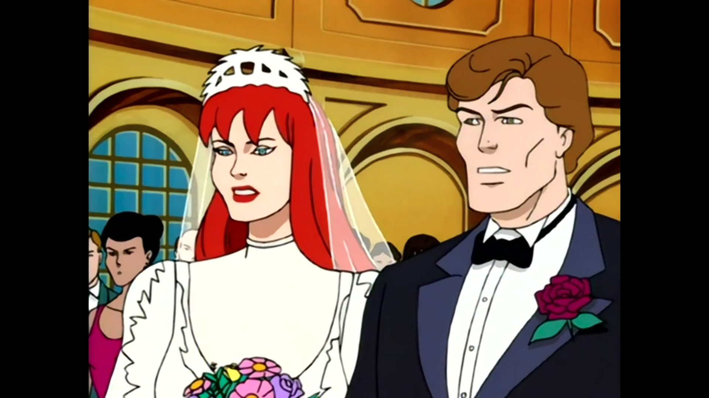
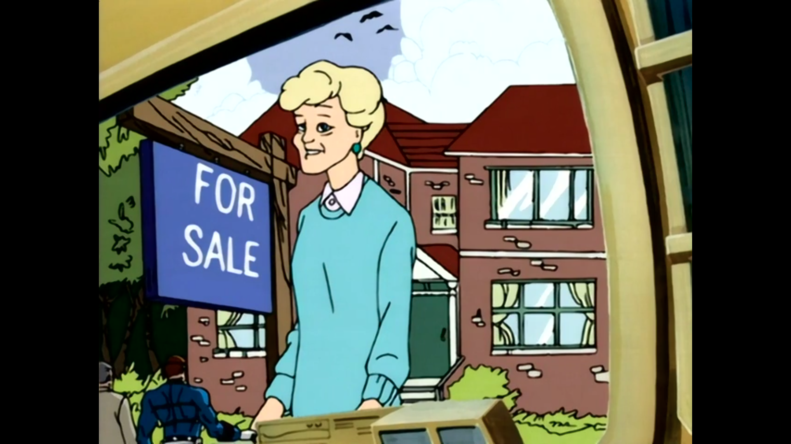
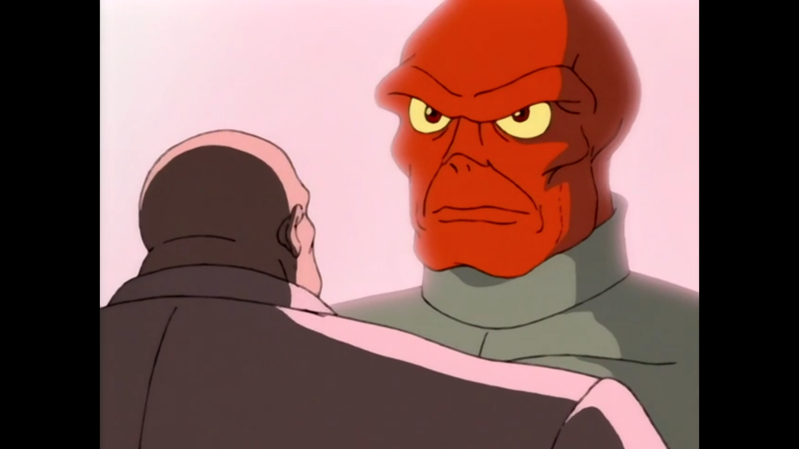
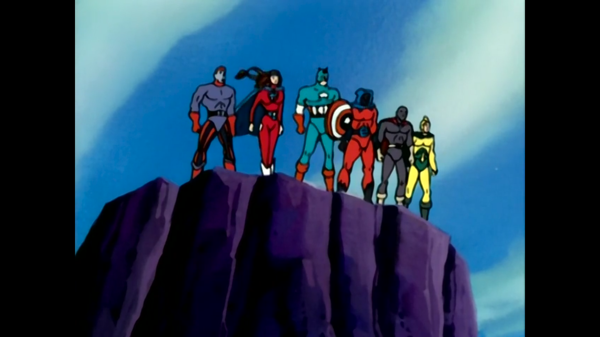
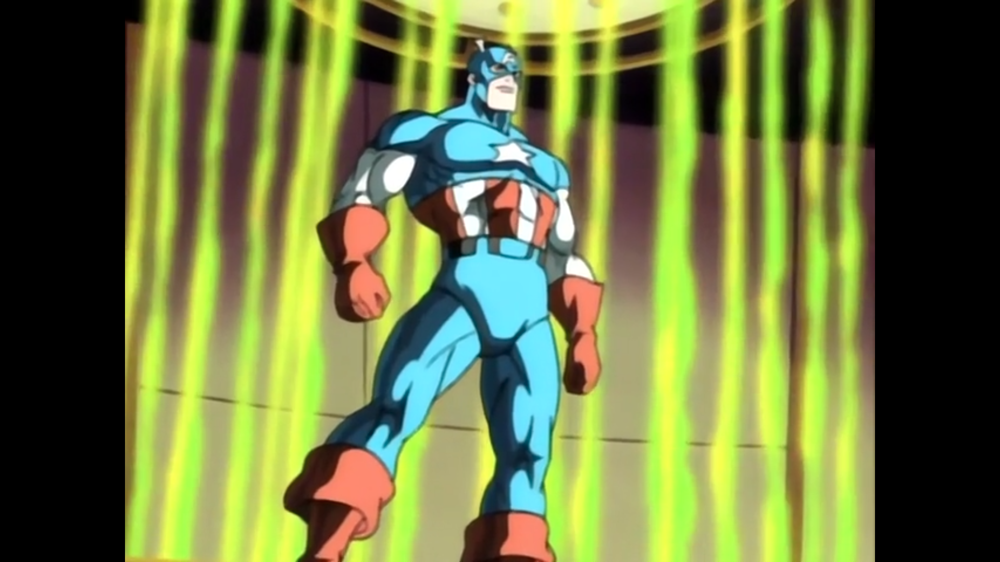
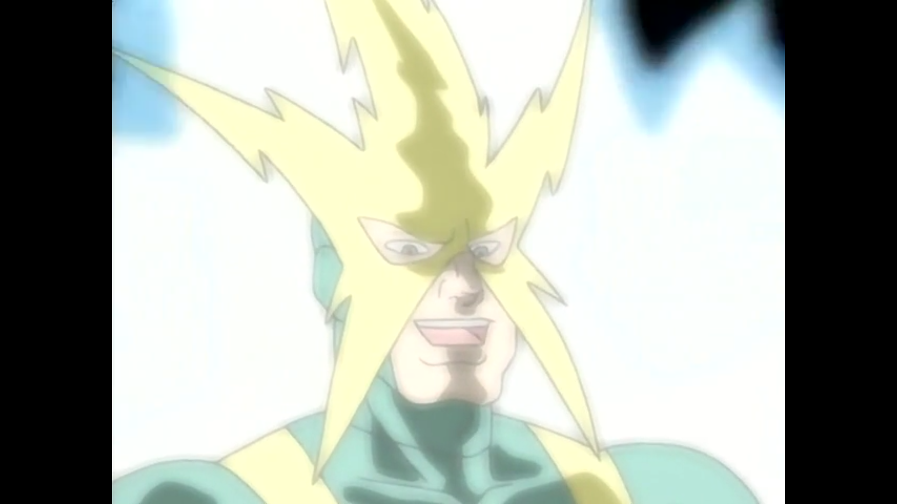

Spider-Man: The Animated Series (Season 05)
###########################################

:date: 2025-10-26 09:48
:modified: 2023-10-26 09:48
:tags: tv, spider-man
:category: tv
:slug: spider-man-season-five
:authors: Andre Fellipe da Silva
:summary: After four years of alternating between writing and procrastination, my **Spider-Man:TAS** project has come to an end. I am already crying. This post was written to the sound of The Cars' `Heartbeat City`_. You can listen one of the songs here_.

Season 4 of the show was the worst season so far. Can the final season rebound and end the show on a high note? Stay tuned to find out.

Bob Richardson directed all episodes.

**The Wedding**
***************

.. class:: center

*"I object to this marriage." - Green Goblin*

**Story by**: John Semper.

**Teleplay by**: John Semper and Meg McLaughlin.

Mary Jane Watson and Peter Parker are ready to tie the knot, but there are major obstacles to be faced before and during the cerimony. The season starts off in strong fashion, with a dynamic and interesting storyline with the Green Goblin returning to make sure the wedding does not go as planned. My favorite part was both Jameson and the Kingpin trying to get one over the other to see who can better help at the wedding, a funny dynamic that added a lot. The Green Goblin returning is always welcoming and see Harry getting better at the end thanks to Liz is a good way to finish the character's arc. The final season finishes up one of the previous season main storylines to kick us off. Let's hope the momentum can be maintained.

**Six Forgotten Warriors: Chapter I**
**************************************

.. class:: center

*"You must stop May Parker." - Nick Fury*

**Written by**: John Semper.

Now, let's add a little bit of the Cold War to the show. Peter Parker's parents as Russian spies? Worked for me, I guess. While this storyline is a little bit out there, the execution of this first part really sets the stage well. The Sinister Six is back thanks to the Kingpin, Parker convinces Jameson to go to Russia in the funniest way possible and May Parker is a global threat. So much happens in this episode that makes me excited to see long-term storytelling once again. The action scenes are well made and now we will uncover a mystery our protagonist's parents. All of this in Russia. Seems like the show is back on form with a spy novel thriller being developed.

**Unclaimed Legacy**
********************

.. class:: center

*"World domination? Kingpin, now you sound like a Saturday morning cartoon villain." - Spider-Man*

**Written by**: John Semper.

Our hero heads to Moscow and all the trouble possible follows him there. Kingpin wants the Doomsday Device and has the Sinister Six to help, and this time they are on the same page. Red Skull almost shows up, but it is his son at this moment. The plot thickens and anticipation begins to mount regarding when Red Skull will show up and what kind of threat will he bring. There was a lot of action and fighting here, with the new surroundings doing the show a breath of fresh air. A good follow-up that did not advance that much of the story, but still brought good action and a resolution to the spy story where we discover that Peter's parents were not spies.

**Secrets of the Six**
**********************

.. class:: center

*"Miss America? The Thunderer? With those names, they expected to be taken seriously?" - Peter Parker*

**Written by**: John Semper.

The world's tackiest super heroes are revealed. The Six Forgotten Warriors backstory is an interesting one, but the characters themselves are tacky, no doubt about it. We spend ten minutes of the episode learning about these new characters and how Captain America fought Red Skull during World War II, really expanding the show's universe with this decision. I find it interesting how the Insidious Six are being used in this arc, being the muscle to go after the Six Forgotten Warriors. Matching the heroes and villains in groups of six creates good action scenes between the thugs and the old school heroes. From a deeper point of view, the final reflection that Peter has regarding where his life will end up is one of the coolest reflections from the show. While not a top tier story from the show, the arc is a return to form to the show and I am excited for its continuation.

**The Six Fight Again**
***********************

.. class:: center

*"Nice catch! Did you ever think of trying out for the Yankees?" - Spider-Man*

**Written by**: John Semper.

The Six American Warriors. The Insidious Six. Red Skull's family. Spider-Man. God knows who else. We approach the end of the arc in explosive fashion, with Kingpin finally getting the six statues together and Red Skull coming back. It is always great when the show can put all of the characters interacting together in well-made fight scenes. Even with a lot of people, these episodes do not look bloated since everyone has a part to play. Captain America returning as well is a lot of fun. Everytime someone thinks they have the upper hand, a new development happens and the tension mounts again, which is awesome. The Cold War climate and espionage atmosphere is doing wonders for this arc, so expectations are high for the resolution in the next episode.

**The Price of Heroism**
************************

.. class:: center

*"The time has come. Submission or oblivion: the choice is yours." - Elektro*

**Written by**: John Semper.

The Doomsday device is our friend... Elektro, the ultimate weapon. This is an interesting choice, I never saw Elektro as this major threat that warrants a full storyline that culminates on him being the big bad of the arc. While I have this reservation, the execution is pratically flawless, with Elektro being portrayed as an all-powerful entity causing chaos throughout the world and everyone having difficulties stopping him. We see Captain America and Red Skull get absorved in the vortex again and Spider-Man saving the day for everyone, almost putting the world in the status quo of the 1940s. This arc is a victory for the show, being able to keep up good writing through five continuous episodes that felt like a spy novel combined with superhero shenanigans. If you told me that the show would have made a five-part episode with a bunch of new superheroes work, I would bet against, but long-term storytelling is one of the strongest parts of **Spider-Man: TAS** and this was shown once again here.

.. _`Heartbeat City`: https://en.wikipedia.org/wiki/Heartbeat_City
.. _here: https://www.youtube.com/watch?v=E0Kv6vxZwL8
